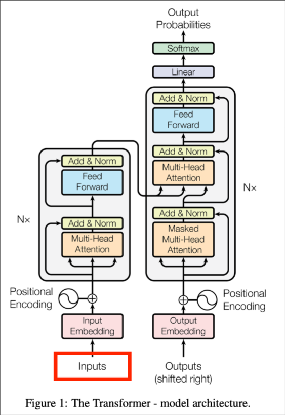

**基于transformer的模型处理文本，需要把文本切分成一个个token，分词技术是解决模型输入预处理的问题**


## 分词定义

Tokenization将一个整体（如短语、句子、段落、语音和图像）切分成一个个token，让机器方便处理

## 分词的目的

自然语言处理有非常多下游任务，分词是子任务的基础，相比于英文可以通过空格分词，中文就不行了

1.**分词标准不统一**：比如“中华人民共和国”应该划分为一个token,但在另外的一个任务中被划分为“中华”，“人民”，“共和国”三个token

2.**切分歧义**：“老人管理系统”，如果划分为“老人”，“管理”，“系统”（老人进行操作的系统），如果划分为“老人管理”，“系统”（一个系统的作用是用来管理老人）

3.**未登录词处理**：词典中未收录的新词和中英文混杂的词

## 中文分词算法

### 基于词典的规则匹配算法

基于词典的分词算法依赖于预先构建好的词典，通过字符串匹配的方式将句子切分成一个个token,根据匹配策略的不同，分为以下算法：

#### 正向最大匹配法（FFM）
原理：句子从左到右，尽可能匹配最长的词语
```python
def forward_max_matching(sentence,dictionary,max_len=6):
    result = [] # 初始化一个空列表
    i = 0
    while i < len(sentence):
        matched = False
        for j in range(max_len,0,-1):
        # j初始化为max_len（此处为6），每次迭代-1，0为循环结束值
        # 目的是尽可能找到最大的token，max_len是规定的最大token长度，j一点点缩小
            if i+j > len(sentence):
                continue
            # 判断边界条件，每次都要首先写
            word = scentence[i:i+j]

            if word in dictionary:
                matched=True
                result.append(word)
                i+=j
                break

        if not matched:
            result.append(sentence[i])
            i+=1
        #如果没有匹配到，那就说明这就是一个单字，直接写上

    return result

dictionary={'商务处','女干事','商务','处女','干事'}
sentence="商务处女干事"

print('/'.join(forward_max_matching(sentence,dictionary)))
# ['商务处','女干事']用'/'将这两个token连接在一起
# 输出为:商务处/女干事
```

#### 逆向最大匹配法（BMM）
原理：句子从右到左，尽可能匹配最长的词语（与FMM相反）

```python
def backward_max_matching(scentence,dictionary,max_len=6)
    result=[]
    i=len(scentence)
    while i>0:
        matched=False
        for j in range(max_len,0,-1):
            if i-j<0:
                continue

            word = scentence[i-j:i]
            if word in dictionary:
                matched=True
                result.insert(0,word)
                # 在列表开头插入元素，原先元素往后移动一位
                i-=j
                break
        if not matched
            result.insert(0,sentence[i-1])
            i-=1
    return result

dictionary={'商务处','女干事','商务','处女','干事'}
sentence="商务处女干事"

print('/'.join(backward_max_matching(sentence,dictionary)))
# ['商务处','女干事']用'/'将这两个token连接在一起
# 输出为:商务处/女干事

```

#### 双向匹配分词法

原理：同时采用正向最大匹配和逆向最大匹配，选择二者中词数最小的那个


#### 全切分路径选择法

原理：枚举所有可能的切分路径，通过某种评价标准（如词频、概率）选择最优的切分结果
主要包括两种方法：
1.**基于最短路径的算法**：将切分问题转化为**图论中的最短路径问题**。构建一个有向无环图（DAG），节点代表切分点，边代表词语。边的权重可以基于词频或其它指标，选择权重和最小或最大的路径

2.**基于n元语法模型的算法**：在最短路径算法的基础上，考虑词与词之间的上下文关系。使用n元语法模型（如二元、三元）来评估切分路径的概率，通过最大化路径的概率来选择最优切分结果。

  什么是n元语法模型（n-gram）

  n-gram认为一个词出现的概率，可以由它前面的n-1个词决定

  比如：

  （1）1-gram:只看词本身的频率$P(北京)$

  （2）2-gram:当前词出现的概率依赖于前一个词$P(天安门|北京)$

  （3）3-gram:当前词出现的概率依赖于前两个词$P(讲话|国家主席，新年)$


### 基于统计的机器学习方法

#### 隐马尔可夫模型（HMM）
原理：HMM是一种统计模型，适用于处理序列数据。在分词中，HMM将每个字标注为B(词首)、M（词中）、S(单字词)中的一种，通过概率模型来预测最可能的标注序列。

模型组成：

1.状态集合：{B,M,E,S}

2.观测集合：汉字序列

3.初始状态概率：各状态作为起始状态的概率

4.转移概率：状态之间的转移概率

5.发射概率：状态对应观测的概率

公式：

使用贝叶斯公式计算给定观测序列的最可能状态序列：

$$P(Q|O)=\frac{P(O|Q)P(Q)}{P(O)}$$

其中，Q是状态序列，O是观测序列

HMM用**Viterbi算法**求解最可能的状态序列，jieba分词采用了HMM隐马尔可夫模型和viterbi算法来解决未登录词问题。

#### 条件随机场（CRF）
原理：CRF是一种判别式模型，适用于序列标注任务。与HMM不同，CRF直接建模条件概率$P(Q|O)$,不涉及隐状态的状态概率和发射概率。

优势：能够充分利用上下文信息，适合处理复杂的特征。

公式：

$$P(Q|O)=\frac{1}{Z(O)}exp(\sum_{t=1}^T\sum_k\lambda_kf_k(q_{t-1},q_t,O,t))$$

其中，$Z(O)$是归一化因子，$f_k$是特征函数，$\lambda_k$是特征权重。

## 在LLM时代，为什么需要分词

以最新的视角来看分词算法，根据拆分粒度不同，Tokenization主要分为三种类型：**词粒度（Word-based）、子词粒度（Subword-based）和字符粒度(Character-based)**。

每种粒度在不同应用场景中具有各自的优缺点，尤其是在处理中文等没有天然分隔符的语言时，选择合适的粒度尤为重要。

```
Let us learn tokenization

Word-based:["let","us","learn","tokenization"]
Subword-based:["let","us","learn","token","ization"]
Character-based:["l","e",···,"o","n"]
```

### 词粒度（Word-based）分词

词级Tokenization将文本拆分为独立的词语，是最自然的语言单元。

优点：

语义清晰，模型效果好

缺点：

词典规模庞大，未登录词问题（新词、专有名词等未在词典中的词语难以处理）

### 字符粒度（Character-based）分词
定义：

字符级Tokenization将文本拆分成单个字符，是最基本的拆分单元。对于英语，每个字母或标点符号都是独立的字符；对于中文每个汉字也是一个字符。

优点：

词典规模小（字符数量有限，比如英语只有26个字母和其它的标点符号），处理未登录词（所有未登录词都由基本字符组成）

缺点：

语义表达弱：单个字符难以承载丰富的语义信息，模型需要通过组合多个字符来理解词义

序列长度增加：增加计算负担

### 子词粒度（Subword-based）分词

定义：

将词语拆分成更小的单位，例如词根、前缀、后缀等。常见方法包括**BPE(Byte Pair Encoding)、WordPiece和Unigram**

优点：

平衡词汇表大小和语义表达，处理未登录词

缺点：

子词边界模糊（拆分后子词可能会失去部分语义信息，尤其是对于语素丰富的语言）

复杂性增加（子词级分词算法复杂）

##面试考点

### 1.为什么不使用词粒度（Word-based）分词？

**长尾效应和稀有词问题**：词表可能变得巨大，包括很多不常见的词汇，增加存储和训练成本，稀有词的训练数据有限，难以获得准确的表示。

**OOV（Out-of-Vocabulary）**:无法处理词表以外的词汇

LLM为什么不基于Word-based的统计机器学习方法来分词（如CRM、HMM等）

答：一方面有上述两个问题，另一方面是这些方法不具有一个固定词表，导致没有一个确定性的映射。为什么LLM要确定性的映射？
因为词在编码之后还要解码，因此必须要一个可逆的过程，类似函数和反函数。

### 2.为什么不用字符粒度（Character-based）

字符粒度最重要的是解决了OOV问题，但存在如下缺点：

1.语义信息不明确：字符粒度分词无法直接表达词的含义

2.处理效率低：文本被拆成字符，处理粒度小

另外：Word-based与Character-based都可以看作是以人造规则来切词。
我们在LLM的分词中，希望能自动发现一些切词的规则。
我们将着重介绍LLM使用的Subword粒度分词方法。

##BPE(Byte-Pair Encoding)

字节对编码最初是一种简单的数据压缩形式。每步压缩中奖常见的一对连续字节数据（bytepair）
替换为该数据中不存在的字节（newbyte）

算法流程：

1.计算初始词表：先把训练语料分成最小单元（英文中26个字母加上各种符号以及常见中文字符）

2.构建频率统计：统计所有子词单元对（即两个连续的子词）在文本中的出现频率

3.合并频率最高的子词对：合并出现频率最高的子词对，并更新词汇表和merge rule

4.不断重复步骤2和3，直到达到预定的词汇表大小、合并次数，或者直到不再有有意义的合并
（即，进一步和并不会显著提高词汇表的效益）

5.分词：使用最终得到的merge rule对文本进行分词

```python
def BPE():
    while len(vocab) < target_vocab_size:
    # 统计新词表导致的bigram频率
    bigram_frequency = get_freq(word_freq)
    # 找到频率最大的bigram
    best_bigram = argmax(bigram_frequency)
    # 新词为频率最大的bigram的链接
    new_unigram = ''.join(best_bigram)
    # 在当前的词频表 word_freq 中，将所有出现过的 best_bigram（即频率最高的相邻词元对）合并为一个新的词单元 new_unigram
    # 并且遍历所有词，把其中包含best_bigram的部分替换成new_unigram
    word_freq = merge_bigram(best_bigram,new_unigram,word_freq)
    # 添加合并规则、添加新词
    merge_rule.append({best_bigram->new_unigram})
    vocab.append(new_unigram) 

def get_freq(word_freq):
    bigram_frequency = {}
    # 对于word_freq中每个词word和对应的频率freq
    for word,freq in word_freq.items():
        # 将word按当前分词方案切分
        unigrams = word.split("/"):
        for unigram in unigrams:
        # 统计当前切分方式下，每个相邻词元（unigram）对（即 bigram）在整个语料库中出现的总频率
        # (unigram, next_unigram)：组成一个 bigram（二元组） ，例如 ('e', 's') 或 ('low', 'er')
        # bigram_frequency：一个字典，用来记录每个 bigram 出现的累计频率。
            bigram_frequency[(unigram,next_unigram)] += freq
    
    return bigram_frequency
# 这就是 BPE 算法中最关键的一步 ：不断合并高频相邻子词，逐步构建出更高效的词汇表。

def merge_bigram(best_bigram,new_unigram,word_freq):
    # 遍历带切词信息的词频表word_freq中每个词
    for word in word_freq:
    # 如果里面有best_bigram，合成new_unigram
        word_substitude(best_bigram,new_unigram)
    return word_freq

```


```python

from collections import defaultdict

# 初始化词表（假设初始词表为所有字符）
vocab = set()
word_freq = {"l o w </w>": 5, "l o w e r </w>": 2, "n e w e s t </w>": 6, "w i d e s t </w>": 3}
target_vocab_size = 20  # 目标词表大小
merge_rules = []  # 记录合并规则

# 初始词表：所有单个字符 + </w>（表示词尾）
for word in word_freq:
    for char in word.split():
        vocab.add(char)

# BPE 主算法
while len(vocab) < target_vocab_size:
    # 1. 统计当前所有 bigram 的频率
    bigram_freq = defaultdict(int)
    for word, freq in word_freq.items():
        subwords = word.split()
        for i in range(len(subwords)-1):
            bigram = (subwords[i], subwords[i+1])
            bigram_freq[bigram] += freq

    # 2. 找到频率最高的 bigram
    if not bigram_freq:
        break  # 如果没有可合并的 bigram，提前终止
    best_bigram = max(bigram_freq, key=bigram_freq.get)
    
    # 3. 合并最佳 bigram（如 ('e', 's') -> 'es'）
    new_token = ''.join(best_bigram)
    merge_rules.append((best_bigram, new_token))
    vocab.add(new_token)

    # 4. 更新词频表，合并所有出现的 best_bigram
    new_word_freq = {}
    for word, freq in word_freq.items():
        new_word = word.replace(' '.join(best_bigram), new_token)
        new_word_freq[new_word] = freq
    word_freq = new_word_freq

# 输出最终词表和合并规则
print("Final Vocabulary:", vocab)
print("Merge Rules:", merge_rules)
print("Final Word Frequencies:", word_freq)

# 结果
# Final Vocabulary: {'d', 'est', '</w>', 'es', 'est</w>', 'low', 'n', 'ne', 'r', 'w', 'o', 'l', 'e', 'i', 'lo', 't', 's', 'low</w>', 'newest</w>', 'new'}
# Merge Rules: [(('e', 's'), 'es'), (('es', 't'), 'est'), (('est', '</w>'), 'est</w>'), (('l', 'o'), 'lo'), (('lo', 'w'), 'low'), (('n', 'e'), 'ne'), (('ne', 'w'), 'new'), (('new', 'est</w>'), 'newest</w>'), (('low', '</w>'), 'low</w>')]
# Final Word Frequencies: {'low</w>': 5, 'low e r </w>': 2, 'newest</w>': 6, 'w i d est</w>': 3}
```


