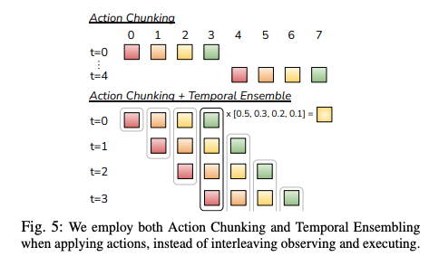

# ALOHA机器人平台：低成本、高精度双臂操作及其进展深度解析

## ALOHA

[ALOHA](https://arxiv.org/pdf/2304.13705)

ALOHA（A LOw-cost HArdware，低成本硬件）旨在通过显著降低成本和开源的机器人系统，实现高精度的双臂操作。

ALOHA 项目的初衷是探索学习算法能否让低成本、固有精度不高的硬件执行如穿线或插入电池这类精细操作任务。传统上，这些任务需要昂贵、高精度的硬件。ALOHA 通过开源硬件设计（包括 3D 打印说明）和软件实现，显著降低了先进机器人系统的门槛。

该项目的核心是**模仿学习**的应用，通过利用人类演示的细微理解和灵巧性，简化了对“不精确”硬件的控制。这种方法有效地利用数据驱动来弥补硬件限制，从而实现所需的精度，避免了对昂贵传感器和繁琐校准的依赖。ALOHA 项目名称本身就强调了其对硬件组件的重视，认为可及且经济实惠的硬件平台是实现模仿学习所需大量真实世界演示数据收集的关键。

这种动态揭示了机器人开发中一个反复出现的模式：硬件的突破往往为软件研究开辟新途径，反之，软件创新也能推动硬件设计的边界。

### 动作分块 Transformer (ACT) 架构

**动作分块 Transformer (ACT)** 是 ALOHA 项目的核心架构创新，使其在精细操作方面展现出卓越能力。它将强大的 Transformer 神经网络架构调整用于机器人控制，通过预测动作序列或电机控制信号来实现精细操作。

**ACT 的核心组件**包括：

- **编码器**：聚合并处理多模态输入，
    - **视觉观测**:来自多个摄像头的图像数据（例如，原始ALOHA设置中的四个摄像头）首先通过卷积神经网络（CNN），如ResNet18骨干网络，提取相关的视觉特征。位置嵌入应用于这些特征以保留空间信息 。
    - **本体感受输入**:有关机器人内部状态的信息，特别是其当前的关节位置或电机状态，被输入到编码器中。这提供了关于机器人物理配置的关键反馈 。
    - 独特的“**风格变量**”:由一个独立的Transformer编码器生成,风格变量通过正则化捕获人类演示中的非关键性变异，并在推理时设置为零，从而使模型专注于核心任务。
- **解码器**：接收编码器的统一表示，并自回归地预测一系列未来动作，即“**动作块**”。

“风格变量”  是一项微妙而影响深远的创新。人类演示本身是多变的；不同的人可能以略微不同的速度、轨迹或风格细微差别执行相同的任务。一个简单的模仿学习模型可能会试图精确地复制所有这些变异，这可能导致机器人行为不一致或不够优化。风格变量通过将这些非关键性变异正则化到一个潜在空间中，并在推理时将其设置为零，使得模型能够学习任务的基本机制，同时有效地忽略不相关的“风格”。这种机制对于从多样化的人类演示数据中学习鲁棒和可泛化的策略至关重要。

ACT整合来自多个摄像头和本体感受数据（关节位置）作为输入的能力 ，证明了多模态信息对于精细操作的必要性。视觉反馈提供了关于环境和物体的关键上下文，而本体感受则提供了关于机器人自身身体状态的精确信息。Transformer的注意力机制特别适合有效地将这些不同的数据流整合到“连贯的潜在空间”中 ，这对于实现协调、注重细节和流畅的动作执行至关重要。这种多模态方法是先进具身智能研究中的一个普遍主题，因为单一模态通常不足以应对复杂的真实世界任务。 

**动作分块机制**是 ACT 的一项核心创新，它不是一次预测和执行单个动作，而是在一次前向传播中生成固定长度的未来动作序列。这种机制带来多重益处：

- **减少复合误差**：在模仿学习中，即使预测动作中的微小误差也可能随着时间的推移累积和复合，导致与期望轨迹的显著偏差，并最终导致任务失败。通过分块预测动作，ACT有效地缩短了控制问题的“有效预测范围”，从而减轻了这些复合误差的累积 。自回归的单步预测固有地导致复合误差。动作分块通过预测序列，有效地减少了预测的“有效范围”，从而减轻了这些复合误差的累积和影响。
- **增强稳定性和平滑性**：按照预先规划的块执行动作有助于实现更流畅、更连续的机器人运动，消除单步预测中常见的抖动行为。
- **提高效率**：一次性预测多个动作减少了推理调用的频率和整体决策开销。

ACT通常作为条件变分自编码器（CVAE）的解码器组件来实现。在此设置中，CVAE编码器处理多视图相机图像、机器人关节状态和潜在风格变量。Transformer解码器随后利用此编码信息输出完整的动作块。这种CVAE集成有助于重建输入、生成新样本以及有效过滤人类遥操作数据中不需要的变异，从而实现更鲁棒的策略学习 。虽然原始ACT通常使用固定块大小，但最近的进展，如分块因果Transformer（CCT），已将此概念扩展到支持可变块大小和混合动作序列的生成。
这种灵活性允许更复杂的控制策略，例如将高级稀疏路径点与详细的低级关节位置命令相结合 。

### 时间控制与轨迹平滑

除了预测动作序列，ALOHA还整合了复杂的时间控制机制，以确保机器人运动的平滑、连续和响应性，这对于实际部署至关重要。这些技术植根于类似于模型预测控制（MPC）的概念，并为在嵌入式平台上实现效率而进行了进一步优化。

- **ALOHA 语境下的模型预测控制 (MPC)**：ACT规划未来步骤和预测动作序列的能力与模型预测控制（MPC）的原理内在一致。在典型的MPC框架中，模型在每个时间步预测一个预定“范围”内的未来动作序列。然而，通常只执行此规划序列中的第一个动作，之后整个规划过程将根据更新的观测值重新启动 。ALOHA对MPC的独特适应性在于，它通过模仿学习训练Transformer模型直接输出这些动作序列，从而避免了传统上计算密集型、基于优化的控制方法
- **时间集成 (Temporal Ensemble, TE)**：为了实现异常平滑和协调的机器人轨迹，ALOHA采用了一种称为时间集成（Temporal Ensemble, TE）的技术。这种方法涉及对同一未来时间步的预测动作进行加权平均，并从多个规划范围中获取。例如，如果在T=0时，模型预测了t=0、t=1、t=2和t=3的未来动作，然后在T=1时，它预测了t=1、t=2、t=3和t=4的动作，那么最终为t=1执行的动作将是T=0时对t=1的预测和T=1时对t=1的预测的加权平均 。   

    - 目的： 这种加权平均过程在平滑任何运动抖动并确保机器人轨迹流畅、连续和视觉自然方面非常有效 。   

    - 挑战： 传统时间集成的一个关键挑战是其计算需求；它理想情况下需要在每次动作执行之前进行一次完整的模型推理。在资源受限的嵌入式平台上，推理频率可能接近甚至低于动作执行频率，这可能导致运动不连续并影响实时性能 。   

时间集成解决了“断续和快速运动”以实现“平滑和缓慢”的运动。这突显了机器人控制中一个关键的实际考量：抖动或不连续的运动不仅不美观，还可能导致硬件磨损增加、潜在的不稳定性以及任务性能下降。ALOHA对时间集成和TEDA的专门关注，表明它对机器人实际部署挑战的深刻理解，超越了单纯的任务成功率，涵盖了执行的质量和流畅性。   

- **带丢弃动作的时间集成 (Temporal Ensemble with Dropped Actions, TEDA)**

    - TEDA的运行机制： TEDA创新性地将动作序列的执行与策略预测并行化。它首先在t=0时进行一次预测以获得一个包含‘k’个预测动作的块。关键在于，TEDA不是在每个后续时间步都进行新的预测，而是策略性地“丢弃”一些动作，这意味着它在进行下一次完整的模型推理之前，会执行一个预先预测的块几个步骤。
    然后，“时间集成”在应用这些动作时进行加权平均，可能跨越这些“丢弃”的间隔，从而确保连续性 。   

    以自动驾驶系统为例，TEDA 的运行机制可以这样理解：在车辆行驶过程中，TEDA 首先会对未来一段时间内的驾驶动作（如加速、减速、转弯等）进行一次初始预测，得到一个包含多个预测动作的集合。然后，在实际行驶过程中，它不会每个时刻都重新进行预测，而是根据当前的路况和车辆状态，选择性地执行预先预测的动作。
    例如，如果前方路况较为稳定，TEDA 可能会 “丢弃” 一些不必要的动作，专注于执行那些能够保持车辆稳定行驶的动作。在执行这些动作时，TEDA 会根据不同时间点的路况信息，对动作进行加权平均。
    比如，在遇到轻微的道路弯曲时，会根据当前的车速和弯道曲率，对转弯动作进行适当的加权调整，以确保车辆能够平稳地通过弯道，而不是突然转向或转向不足。这样，TEDA 就能够在保证驾驶安全性和稳定性的同时，提高系统的运行效率和响应速度。

    - 1. **单次预测块内的执行** 

        - 当在时刻 \( t \) 预测出一个包含 \( k \) 个动作的块 \( \{a_{t,1}, a_{t,2}, \dots, a_{t,k}\} \) 后，系统会按顺序执行这些动作。  
        - **默认情况下**，每个动作 \( a_{t,m} \) 直接对应第 \( m \) 时间步的执行指令，无需加权（如 \( m=1 \) 时执行 \( a_{t,1} \)，\( m=2 \) 时执行 \( a_{t,2} \)）。  

    - **跨预测块的“丢弃”与加权调整**  
        - 当系统在执行到第 \( m \) 时间步时（\( m < k \)），若决定“丢弃”后续 \( n \) 个动作（即跳过 \( m+1 \) 到 \( m+n \) 时间步），则需要触发新的预测块 \( \{a_{t+1}, a_{t+2}, \dots\} \)。  
        - **关键加权场景**出现在**新旧预测块的重叠时间步**。例如：  
            - 原预测块在 \( m+1 \) 时间步的动作是 \( a_{t,m+1} \)，新预测块在 \( m+1 \) 时间步的动作是 \( a_{t+1,1} \)（假设新块从 \( t+1 \) 时刻开始，第1个动作对应原 \( m+1 \) 时间步）。  
            - 此时，执行 \( m+1 \) 时间步的动作时，需对 **原块的 \( a_{t,m+1} \)** 和 **新块的 \( a_{t+1,1} \)** 进行加权平均，公式为：  
       \[
       a_{\text{executed}} = \omega_0 \cdot a_{t,m+1} + \omega_1 \cdot a_{t+1,1} \quad (\omega_0 + \omega_1 = 1)
       \]  
     - 权重 \( \omega_0 \) 和 \( \omega_1 \) 由时间距离（如 \( \omega_0 \) 随“丢弃”的时间步长衰减）或预测置信度决定。

**举例说明：加权调整的触发场景**

假设 \( k=5 \)（每次预测5步动作），时间线如下：  

- **时刻 \( t=0 \)**：预测块为 \( [A_1, A_2, A_3, A_4, A_5] \)（对应时间步1-5）。  
- **执行到时间步3**（即已执行 \( A_1, A_2 \)，正准备执行 \( A_3 \)）：  
  - 若系统决定“丢弃” \( A_3 \) 和 \( A_4 \)，直接执行 \( A_5 \)，则需要在 **时间步3和4** 触发加权调整（因为 \( A_3 \) 和 \( A_4 \) 被跳过，但系统不能直接从 \( A_2 \) 跳到 \( A_5 \)）。  
  - 此时，可能触发新预测块 \( [B_1, B_2, \dots] \)（对应时间步3及之后），则：  
    - **时间步3的执行动作** = 加权平均 \( A_3 \)（原块）和 \( B_1 \)（新块）。  
    - **时间步4的执行动作** = 加权平均 \( A_4 \)（原块）和 \( B_2 \)（新块）。  
    - **时间步5的执行动作** = 直接执行 \( A_5 \) 或 \( B_3 \)（取决于是否继续使用原块或完全切换到新块）。  

  - 加权对象是 **同一时间步在不同预测块中的动作**（如原块和新块在时间步 \( m+1 \) 的动作），而非“前几个时间步预测的同一个未来动作”。  
  - 加权的目的是 **平滑过渡新旧预测块**，而非对同一预测块内的多个动作取平均（除非主动设计多模型集成）。  

TEDA的加权调整仅发生在 **“丢弃”动作并触发新预测块时**，用于处理**新旧预测块在重叠时间步的动作冲突**，通过加权平均实现平滑切换。其本质是**跨预测块的时间域信息融合**，而非对单一预测块内动作的内部平均。

- 对边缘设备效率和实时部署的益处：

    - 提高效率： 通过降低完整模型推理的频率，TEDA显著降低了计算负荷，使得在处理能力有限的嵌入式平台上部署复杂的Transformer模型成为可能 。   
    - 保持平滑性： TEDA成功地保留了时间集成的关键平滑优势，同时提高了机器人的响应能力，并防止了部署过程中的运动不连续性 。   
    - 实时决策： 这种技术使机器人模型能够在动态和不可预测的环境中及时有效地做出实时决策 。   
    - 部署背景： TEDA是旨在促进先进模仿学习算法向经济实惠的嵌入式平台迁移的更广泛流程的组成部分。该流程还包括高效模型压缩（例如，对称量化，将模型参数从32位浮点转换为16位整数表示）和输入形状统一等基本步骤，以优化资源受限硬件的性能 。   

TEDA和随附的模型压缩技术（如量化）的引入  揭示了一个重要的工程障碍：先进的AI模型，特别是基于Transformer的架构，计算密集，但许多机器人应用需要部署在资源受限的嵌入式平台上。TEDA与量化直接解决了这种“资源差距”。仅仅开发一个强大的算法是不够的；
它还必须能够在机器人硬件的实际限制下高效地实时部署。这标志着一种全面的、全栈的工程方法，涵盖了从算法设计到硬件优化的各个方面。大型复杂AI模型的固有计算需求，加上嵌入式硬件的有限资源，带来了显著的部署挑战，包括潜在的不连续运动和高推理成本。
TEDA与模型压缩相结合，直接减轻了这些问题，实现了在边缘设备上高效、平滑的实时推理。   

模型预测控制（MPC）原理（规划未来动作）与时间集成（对当前动作的过去预测进行平均）的协同结合，体现了一种迭代的、反馈驱动的控制循环。机器人不仅仅执行预先计算的静态路径；
相反，它根据新获得的观测和先前预测的历史上下文不断重新规划和细化其当前动作。这种动态和自适应的特性对于在真实世界环境中有效导航和执行任务至关重要，因为在这些环境中，不可预见的干扰或微小的执行误差需要持续的修正和适应。
这种复杂的控制范式反映了生物系统中观察到的自适应和鲁棒的运动生成，这些系统通常将预测性规划与实时感官反馈和内部平滑机制相结合，以确保流畅和有弹性的运动。

### 演示能力与精细操作任务

ALOHA 项目在精细双臂操作方面展现了卓越的能力，尽管使用了低成本硬件，但在执行复杂任务方面仍持续表现出色。

**核心演示任务**包括：

- **电池插入、打开半透明调味杯、穿线**：这些初始任务仅需约 10 分钟演示数据即可达到 80% 至 90% 的高成功率。
- **系鞋带、挂衬衫、更换机器人手指、插入塑料齿轮、堆叠厨房物品**：在后续工作中，ALOHA 展示了更高级和复杂的任务，但这些任务需要更大的数据集（例如，挂衬衫需要 8658 个片段，系鞋带需要 5133 个片段）。

虽然 ALOHA 在结构化任务上取得了高成功率，但在涉及**变形物体**（如挂衬衫、系鞋带）或**高环境变异性**（如“LaceMessy”、随机堆叠的厨房物品）的任务上，性能有所下降。这表明，处理柔软非刚性物体以及在高度非结构化或不可预测环境中操作仍然是机器人学习的巨大挑战。

ALOHA“低成本和不精确硬件”实现“精细操作”的显著成就。这在传统机器人领域呈现出一个显著的悖论，因为精度通常与高成本和复杂传感器直接相关。
ALOHA通过证明模仿学习可以弥合这一差距，有效地解决了这个悖论。学习算法通过从人类演示中获取鲁棒策略，有效地弥补了硬件固有的缺陷，从而将人类的灵巧性和适应性转移到精度较低的机器上。这种范式转变预示着机器人系统的未来发展方向，即学习型方法可能优先于纯粹以硬件为中心的精度。

**演示的精细操作任务和成功率**

| 任务 | 成功率 | 演示数量（片段） | 备注 |
| :--- | :----- | :--------------- | :--- |
| 插入电池 / 打开调味杯 / 穿线 | 80-90% | 10分钟 | 2023年论文中的初始任务 |
| 挂衬衫 (简单) | 75% | 8658 | 涉及变形物体 |
| 挂衬衫 (凌乱) | 70% | 8658 | 涉及变形物体，高变异性 |
| 系鞋带 (简单) | 70% | 5133 | 涉及变形物体 |
| 系鞋带 (凌乱) | 40% | 5133 | 涉及变形物体，高变异性 |
| 更换机器人手指 | 75% | 5247 | 需要毫米级精度 |
| 插入齿轮-1 | 95% | 4005 | 需要毫米级精度 |
| 插入齿轮-2 | 75% | 4005 | |
| 插入齿轮-3 | 40% | 4005 | |
| 随机厨房堆叠 (碗) | 95% | 3198 | |
| 随机厨房堆叠 (碗+杯) | 65% | 3198 | |
| 随机厨房堆叠 (碗+杯+叉) | 25% | 3198 | 高变异性 |

---
[Mobile ALOHA](https://arxiv.org/pdf/2401.02117)

## Mobile ALOHA

原始 ALOHA 系统在桌面操作方面具有开创性，但其静态性质限制了更广泛的实际应用。**Mobile ALOHA** 的开发将平台能力扩展到全身移动操作，显著扩大了其效用。

1、**Mobile ALOHA 的设计原则**：

- 原理： 转向Mobile ALOHA的驱动力在于认识到人类环境中大多数机器人任务都需要超越固定工作空间的移动性和全身控制。Mobile ALOHA直接解决了这个问题，将机器人能力从受限的桌面设置推向更通用和动态的真实世界场景 。
尽管桌面操作令人印象深刻，但它“缺乏执行通用任务所需的移动性和灵巧性”。这突出了静态机器人设置的根本局限性。为了使机器人真正融入并服务于以人为中心的环境（如家庭、办公室或工厂），它们必须具备在更广阔、动态的物理空间中导航和与物体交互的能力。
Mobile ALOHA直接解决了这一关键需求，有效地将研究重点从受限的实验室环境转向更现实、非结构化和广阔的真实世界场景。这种向移动操作的演进是开发真正通用机器人的关键一步，使其从高度专业化的工业机械臂转变为多功能、适应性强的助手，能够执行各种任务。   

- 设计原则： Mobile ALOHA被构想为一个低成本、全身遥操作系统，专门为移动操作任务中的高效数据收集而设计 。  

    - 它通过将其集成到轮式移动基座上，增强了现有的ALOHA系统（包括灵巧的双臂） 。   
    - 该系统具有创新的全身遥操作界面：操作员通过物理连接到系统并“反向驱动”轮子，从而允许移动基座独立移动，同时操作员双手控制两个ALOHA机械臂。这实现了运动和操作的无缝协调 。   
    - 硬件设计包括两个腕部摄像头和一个顶部摄像头，以及集成的板载电源和计算单元。机器人手臂（Interbotix ViperX 300）提供了显著的伸展范围，最小/最大高度为65厘米/200厘米，从基座延伸100厘米 。   
    - 移动基座设计实用，能够以与人类步行相当的速度（约1.42米/秒）移动，即使在操作重型家用物品时也能保持稳定 。

2、**全身遥操作与增强数据收集**

Mobile ALOHA采用监督行为克隆作为其主要的模仿学习方法，根据通过其全身遥操作系统收集的多样化数据训练策略 。Mobile ALOHA的动作空间巧妙地通过将ALOHA机械臂的14个自由度（DoF）关节位置与移动基座的线速度和角速度连接起来，形成一个全面的16维动作向量。
这种直接的表达方式允许现有深度模仿学习算法的直接应用，几乎无需对其实现进行任何修改 。Mobile ALOHA设计的一个显著特点是，它通过简单地将机械臂关节位置与移动基座速度连接成一个单一的统一动作向量 ，从而实现了全身控制。
这种方法“几乎不需要对现有深度模仿学习算法的实现进行任何改变”，这是一个了不起的简化。这表明复杂的全身协调和涌现行为可以从相对简单的动作空间扩展中产生，而不需要根本性的新架构设计或复杂的层次控制范式。
这表明端到端学习的内在力量，模型隐式地学习了机械臂运动和基座运动之间复杂的关联和依赖关系，这些对于执行诸如在后退的同时打开柜子等复杂任务是必要的。   

3、Mobile ALOHA与静态ALOHA数据集协同训练的影响

Mobile ALOHA研究的一项重要发现是，通过将新收集的移动操作数据与现有静态ALOHA数据集（来自原始桌面设置）进行协同训练，可以显著提高性能 。   

- 这种协同训练策略已被证明可以将移动操作任务的成功率提高高达90%，即使每个任务的演示次数少至50次 。   
- 静态ALOHA数据集通常更丰富且更容易收集，它们提供了宝贵的基础知识和先验经验，这些知识和经验可以有效地转移到更复杂的移动场景中 。   

发现“与现有静态ALOHA数据集协同训练可以提高性能”  代表了一个重要的研究发现。这一发现意味着，即使是在更简单、更受控的静态环境中收集的数据，也包含可转移的知识，可以显著加速和改进在更复杂的移动场景中的学习。这是一种强大的迁移学习或课程学习形式，其中在受控环境中获得的基础技能被有效地用于解决更高级和更具挑战性的任务。这种方法最终使整体数据收集过程更高效，因为并非所有必要的数据都需要在最复杂和资源密集型的移动设置中收集。丰富静态操作数据的可用性，当与协同训练技术结合时，能够显著提高数据效率，并增强在复杂移动操作任务上的性能。   

### ALOHA 在更广泛机器人领域中的地位

理解ALOHA的独特贡献需要将其与其他新兴机器人范式（特别是视觉-语言-动作（VLA）模型）区分开来，同时也要认识到潜在的协同作用。

A. ALOHA与视觉-语言-动作（VLA）模型的区别：模态与通用性聚焦

ALOHA本质上不是一个VLA（视觉-语言-动作）模型，因为它“没有语言模态处理” 。

- VLA定义： 视觉-语言-动作（VLA）模型，是复杂的智能系统，旨在将视觉感知与语言理解相结合，以实现机器人控制和更高层次的推理。它们被设计用于解释和执行自然语言指令（无论是口头还是书面）以及视觉观测，以执行真实世界任务 。   

- ALOHA的模态： 相比之下，ALOHA的主要输入模态是视觉数据（来自摄像头）和本体感受数据（机器人关节状态）。其策略是通过直接模仿人类演示来学习的，这意味着它本身不处理或响应语言命令来执行任务 。   

- 任务通用性：

    - ALOHA： 作为针对遥操作优化的硬件平台和模仿学习框架，ALOHA的任务通用性主要受限于提供人类演示的具体任务。它通常被描述为“一个模型一个任务”的基础，对于每项新技能都需要新的演示 。   
    - VLA模型： VLA模型旨在实现“通用机器人策略（GRP）”，即能够解决多个下游任务或适应新任务的统一、单一模型，而无需进行任务特定的微调。这些模型旨在发展出涌现行为，使其能够泛化到未见过的任务、新颖场景甚至不同的硬件配置。著名的例子包括Google DeepMind的RT-2、Pi-Zero和Groot N1 。   

- 基本作用： ALOHA主要作为硬件平台，用于人类控制的遥操作以及开发和评估模仿学习算法的稳健测试平台。相反，VLA模型本质上是软件模型，通过语言理解赋予机器人自主感知、推理和行动的能力 。   

VLA定义为“结合视觉和语言知识以进行机器人控制和更好推理的智能系统”，而ALOHA主要是一个用于遥操作的“硬件平台”。这是一个关键的概念区分。ALOHA提供了强大的物理交互手段和复杂的低级控制框架（ACT），而VLA则贡献了高级认知智能，包括感知、推理和语言理解。这两个类别并非相互竞争，而是互补的。

**ALOHA 与视觉-语言-动作（VLA）模型对比**

| 特征 | ALOHA | 视觉-语言-动作（VLA）模型 |
| :--- | :---- | :-------------------------- |
| 主要作用 | 遥操作硬件平台和模仿学习测试平台 | 用于自主感知、推理和动作的软件模型 |
| 语言处理 | 无原生语言处理 | 原生语言理解（文本/语音） |
| 关键模态 | 视觉、本体感受 | 视觉、语言、动作（及其他传感器数据） |
| 任务通用性 | 任务特定（一个模型，一个任务） | 通用（可适应未见任务，零样本/少样本） |
| 学习范式 | 模仿学习（行为克隆） | 大规模多模态训练 |
| 成本/可及性理念 | 低成本、开源 | |
| 示例 | 原始 ALOHA、Mobile ALOHA | RT-2、Pi-Zero、Groot N1 |

B. **ALOHA 的独特优势与贡献**：

- **可及性**：其低成本和开源性质使先进机器人研究民主化。
- **低成本硬件实现高精度**：通过有效应用模仿学习，证明无需昂贵硬件也能实现高精度操作。
- **通过动作分块实现鲁棒性**：ACT 架构有效缓解了复合误差问题。
- **注重实际部署**：TEDA 和模型压缩等创新解决了在资源受限平台上部署计算密集型 AI 模型的实际挑战。
- **移动操作的基础**：进化到Mobile ALOHA显著扩展了任务范围，从固定基座桌面操作转向动态全身移动操作，从而为更通用和广泛适用的机器人系统奠定了关键基础 。

ALOHA 的开源、低成本特性，加上其在灵巧操作方面的强大性能，使其成为一项“赋能技术”，为其他研究人员测试和验证 AI 模型提供了可及的工具。

### 技术实现与硬件细节

ALOHA 的实际成功取决于其稳健的技术实现，包括硬件设计和支持操作及模型部署的软件环境。

**ALOHA 硬件组件与组装**：

- 系统围绕 **Interbotix XS 机械臂**构建（Mobile ALOHA 使用 ViperX 300 机械臂）。
- 双臂系统，包含多个摄像头提供全面的视觉反馈（原始 ALOHA 四个摄像头，Mobile ALOHA 两个腕部和一个顶部摄像头）。
- Mobile ALOHA 具有板载电源和计算能力。
- 原始 ALOHA 系统成本约为 **20,000 美元**，体现了其对经济实惠的承诺。
- 该项目提供了广泛的开源资源，包括详细的硬件组装教程和快速入门指南，以使用户能够构建自己的系统 。关键的设置程序包括通过USB将机器人连接到计算机并通电。建议使用Dynamixel Wizard等调试工具来验证机器人连接和电机状态 。一个已解决的实际挑战是USB端口分配的动态性；项目提供了使用udevadm规则将每个机器人绑定到固定符号链接端口（例如，ttyDXL_master_right）的说明，以确保一致的识别 。此外，为了防止电机过载，特别是在夹持机构中，建议设置特定的电流限制（例如，200）

**软件环境与开发工作流程**：

- 主要在 **Ubuntu (18.04/20.04)** 上运行，使用 **ROS 1 Noetic**，目前正努力确保与 ROS 2 兼容性。
- 软件安装包括 ROS 和 Interbotix 软件套件。
- 代码库包含机器人配置、ROS 启动文件以及遥操作和数据收集的 Python 脚本。tonyzhaozh/act GitHub 仓库是官方开源中心,提供了在模拟环境（通过gym-aloha）和物理ALOHA硬件上训练和评估ACT策略所需的代码 。

**模型部署考虑：资源受限平台的压缩与量化**：

为了在资源受限的嵌入式平台上部署大型基于 Transformer 的模型，ALOHA 采用了：

- **模型压缩**：为了促进大型基于Transformer的模型在资源受限的嵌入式平台（通常称为“边缘设备”）上的部署，ALOHA采用了对称量化（SQ）等技术。此过程涉及将模型参数从其原始的32位浮点表示转换为更紧凑的16位整数格式。这显著减少了模型的内存占用和计算需求，使得在资源有限的硬件上实现高效推理成为可能 。

**对称量化（无零点）**

假设浮点值分布关于0对称（即最大值和最小值绝对值相近），可忽略零点，直接映射到对称的整数区间。

统计参数的最大值 \( S_{\text{float, max}} \) 和最小值 \( S_{\text{float, min}} \)，取绝对值较大者作为动态范围 \( S = \max(|S_{\text{float, max}}|, |S_{\text{float, min}}|) \)。

计算缩放因子 \( \text{scale} = \frac{2S}{2^{16} - 1} \)（int16的非零范围为±32767）。
浮点值 \( x \) 转换为整数 \( q \) 的公式：  
    \[
    q = \text{round}\left( \frac{x}{\text{scale}} \right)
    \]
    
转换后需确保 \( q \) 在int16范围内（-32768 ≤ \( q \) ≤ 32767）。

**示例**：  

若浮点值范围为[-10, 10]，则 \( S = 10 \)，\( \text{scale} = \frac{20}{32767} \approx 0.00061035 \)。  

浮点值 \( x = 5.6 \) 转换为 \( q = \text{round}(5.6 / 0.00061035) \approx 9175 \)（整数）。

- **输入形状统一**：简化数据处理并优化模型性能。
- **带丢弃动作的时间集成 (TEDA)**：TEDA是实现嵌入式设备上高效、平滑推理的关键组件。它通过智能地并行化动作执行和策略预测来实现这一点，从而最大限度地减少频繁模型推理相关的计算开销，同时保持轨迹平滑 。   

