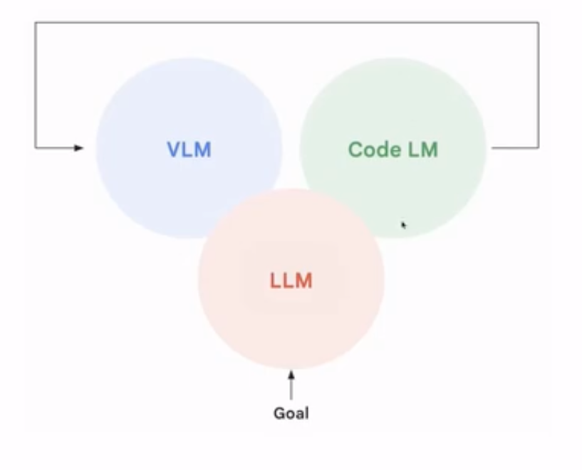

# 机器人基座模型与VLA概述

## AI与机器人发展

近十多年深度学习首先在计算机视觉中取得突破，应用于机器人的感知模块。无人车成为最早应用深度学习的机器人场景之一。

AlphaGo 的出现代表深度强化学习的进步，展示了神经网络在复杂连续状态空间中进行决策的能力。
但是强化学习在游戏和下棋等任务中表现优异，但在机器人领域的通用性仍然有限。

ChatGPT的出现,虽然不是机器人专用模型，但其强大的通用性展示了 AI 可以具备跨任务、跨模态的泛化能力。
为构建通用机器人模型带来了希望。

### 这一次机器人革命的不同

大语言模型的通用性和强大推理能力为机器人提供了新的“大脑”基础。自2023年下半年起，大语言模型开始辐射到机器人领域，成为推动新一轮热潮的关键力量。

传统机器人高度专业化，需要针对不同任务需要开发不同的机器人硬件和软件，无法规模化。
并且出货量低，即使是最成功的工业机器人公司，其产品规模也无法与手机、汽车等消费级产品相比。

人形机器人有通用本体，具有适应多种任务的潜力，是实现通用机器人的关键方向。然后形态统一，避免了针对每个任务重新设计机器形态的需求。

如今技术路线逐渐收敛，越来越多的研究者和创业者倾向于采用统一的架构，如 VLA模型。
但仍在探索最佳的技术路径和应用场景。

- **VLA** 是 Vision（视觉）、Language（语言）、Action（动作） 的统一体，代表一种融合多模态输入输出的通用机器人模型。
    - **Vision**：处理图像、视频等视觉信息。
    - **Language**：理解并生成自然语言指令或描述。
    - **Action**：输出具体的物理动作，驱动机器人执行任务。
- **端到端模型**：
    - 强调统一架构，无需中间模块分割，直接从输入到输出进行梯度回传。
    - 可以 scale（扩展）和泛化（适应多种任务）。

- **模态扩展性**：
    - 虽然命名只有 VLA（Vision-Language-Action），但实际希望整合更多模态（如触觉、声音等）。
    - 目标是构建一个统一的“通感”模型，像人一样具备综合感知与行动能力。

---

- **LAM（Language-Action Model）**：
     - 最初阶段为纯语言模型，仅处理文本信息。
- **VLM（Vision-Language Model）**：
    - 加入视觉模态，形成视觉+语言的联合理解能力。
- **VLA（Vision-Language-Action Model）**：
    - 在 VOM 基础上加入 Action 模态，使模型具备执行物理动作的能力。
    - 成为当前研究的核心方向，被认为是实现通用机器人的关键一步。

- **最核心问题：可扩展的模型架构（Scalable Architecture）**
    - 现有模型尚未找到真正能 scale 到复杂任务的架构。
    - 需要设计出能够持续提升性能、适应不同场景和任务的统一模型。

构建 VLA 模型本身既是一个**科学问题**，涉及认知、学习机制的理解。而在实现该模型的过程则是**工程问题**，包括数据收集、训练策略、硬件适配等。

人就是一个标准的通用 VOA 模型

- 具备视觉、语言、动作的集成能力，能灵活应对各种环境和任务。
- 因此，VOA 的最终形态应类似 AGI（通用人工智能），即具备类人智能的机器人系统。

### 基座模型（Foundation Model）的兴起

- **核心理念**：使用大规模多模态数据预训练统一大模型
- **优势**：
  - 通过 fine-tuning 或 prompt 直接应用于多种任务
  - 实现了"大脑"的统一
  - 显著提升泛化能力和效率

目前主流做法仍属"专用模型"

- **典型代表**：阿罗哈（Aloha）、URT、U20 等机器人
- **特点**：
    - 每个本体 + 每个任务使用独立模型
    - 类似早期 AI 的"小模型+专用开发"模式
    - 虽比传统编程更先进，但仍不具备通用性

### 构建统一的"机器人大脑"

- **目标**：将 Vision（视觉）、Language（语言）、Action（动作）三大模态统一建模
- **特性**：
    - 端到端训练，直接输入指令 → 输出动作
    - 支持 zero-shot 泛化，适应新任务、新本体
    - 可扩展至其他模态（触觉、声音等），形成"通感"模型

### VLA 的技术演进路径

**第一阶段：借用已有模型**

- **方法**：利用现有 VLM（视觉语言模型）或 LLM（语言模型）作为组件
- **示例**：用 ChatGPT 规划任务步骤，结合传统控制方法执行
- **评价**：方法简单但效果有限，无法实现真正端到端控制

**第二阶段：端到端预训练**

- **核心**：构建专门面向机器人的 VLA 模型
- **数据**：使用大量机器人操作数据进行预训练
- **能力**：支持跨任务、跨本体的泛化能力
- **代表**：RT-1、RT-2、Open-VLA、GR-1 等

**第三阶段：引入世界模型与强化学习**

- **世界模型**：
    - 加入对未来状态的预测能力
    - 提升理解环境变化的能力
    - 帮助做出更合理的动作决策
- **强化学习**：
    - 基于 RL 的 fine-tuning
    - 提高复杂任务下的性能上限

#### 规划层的语言模型替代

- **功能**：用 LLM 替代传统任务规划模块
- **过程**：自然语言描述任务 → 拆解成具体步骤
- **示例**：让机器人做咖啡，LLM 自动拆分为抓杯子、倒水、加粉等步骤

#### 感知层的 VLM 替代

- **功能**：用 VLM 替代传统视觉识别模块
- **优势**：
    - 可处理各种物体、场景，无需特定模型
    - 支持零样本识别（zero-shot）
    - 提供动态反馈能力

#### 执行层的动作生成
- **技术方案**：Diffusion Policy、ACT（Action Chunking Transformer）等
- **能力**：
  - 支持长序列动作、精细操作
  - 在仿真和真实环境中均有良好表现

### 当前主流方法与代表性工作

#### 1. **SayCan**

- 使用 LLM 规划任务步骤，结合传统感知与控制模块执行。
- 优势：可以处理复杂逻辑推理任务。
- 缺点：不是端到端训练，无法实时反馈修正。

#### 2. **Inner Monologue（内心独白）**
- 引入环境反馈机制：
    - 执行动作后观察结果，根据反馈进行推理和修正。
    - 类似人类的“思考—行动—反馈—再思考”过程。
- 模拟人类认知闭环，提升任务成功率。

#### 3. **DoReMi(仿真+人形机器人)**

[DoReMi: Grounding Language Model by Detecting and Recovering
from Plan-Execution Misalignment](https://arxiv.org/pdf/2307.00329)

- 在 Inner Monologue 基础上进一步改进：
    - 加入更**及时的反馈机制**（约 10Hz）。
    - 使用 VOM 作为 detector，实时监测任务执行状态。
    - 发现异常时立即重新规划，避免浪费时间。
- 示例：箱子掉落 → 立即检测并重新拾取，而非等到终点才发现失败。

| 方法 | 核心思想 | 是否端到端 | 是否支持反馈修正 | 是否支持泛化 |
|------|-----------|-------------|------------------|---------------|
| SayCan | LLM 规划 + 控制模块执行 | 否 | 有限 | 一般 |
| Inner Monologue | 动作 + 反馈 + 推理 | 否 | 是 | 较好 |
| DoReMi | 实时反馈 + VOM + LLM | 是 | 强 | 强 |

---

**实时反馈机制**

使用 VLM 实时观测任务执行状态。及时发现错误并进行重规划，提高执行效率。

**LLM + VLM 协同工作**

- **LLM 负责高层推理与规划**。
- **VLM 负责环境感知与状态判断**。
- 两者协同，模拟人类“思考 + 观察”的决策过程。

**强化学习增强**

- 在模仿学习基础上引入 RL（如 PPO）进行 fine-tuning。
- 提升模型在复杂任务中的性能上限。
- 需要特殊处理以避免训练不稳定问题。

[VoxPoser: Composable 3D Value Maps
for Robotic Manipulation with Language Models](https://arxiv.org/pdf/2307.05973)

李飞飞团队提出的 “VoxPoser”，利用 VLM 获取空间信息，LLM 进行任务推理，共同生成可执行的控制程序 

### 自动化 Action 的尝试与代表性工作

**传统方法的局限性**  

- 早期机器人动作策略依赖人工编程或预定义规则。
- 即便使用了部分学习方法，也往往需要人为设计特征或选择模型。

**借助 LLM/VLM 实现自动编码** 

- 利用 LLM 的程序生成能力，将自然语言指令直接转化为可执行的机器人控制代码。
     - **VoxPoser**：通过 VLM 感知空间结构，LLM 推理任务逻辑，生成包含 affordance map 和 constraint map 的程序代码，用于机械臂避障与操作 。
     - **Code as Policy**：将 LLM 生成的代码作为机器人策略，实现端到端控制。
     - **微软 ChatGPT 控制机器人实验**（2023年）：利用 GPT-3.5 或 GPT-4 生成机器人控制脚本 。

**优势与挑战**
- **优势**：显著降低了对人工编程的依赖，提升了任务灵活性。
- **挑战**：
     - 生成代码的稳定性与安全性问题。
     - 对真实世界物理规律建模不足，可能导致行为不合理。
     - 无法完全替代机器人自身的具身认知能力。

### 迈向真正通用机器人模型的两条路径

1. **第一类路径：基于现有 Foundation Model 的扩展应用**
    - 直接调用 LLM/VLM，配合已有工具链（如运动规划、感知模块）完成任务。
    - 属于“拼接式”方案，不重构模型架构。
    - 优点：开发成本低，见效快。
    - 缺点：泛化能力有限，缺乏真正的机器人“具身智能”。
    - 目前的工作大多聚焦于此

2. **第二类路径：重新训练/微调专为机器人设计的大模型**
    - 构建专门面向机器人的基础模型（Robot-centric Foundation Model）。
    - 模型架构需考虑多模态输入（视觉、语言、动作）、时序建模、物理约束等。
    - 需要大量机器人交互数据进行预训练。
    - 优点：具备更强的泛化能力与适应性。
    - 缺点：技术门槛高，数据获取困难，训练成本大 。

难点：

1. **模型架构设计**
    - 如何融合语言、视觉、动作等多种模态？
    - 如何建模时间序列与物理交互？
    - 是否采用 Transformer 架构？还是引入新的神经网络结构？

2. **数据收集与标注**
    - 机器人交互数据难以大规模采集。
    - 需要构建统一的数据格式标准（如：观测 + 动作 + 奖励 + 语言指令）。

3. **算法与训练方法**
    - 如何在有限数据下实现有效训练？
    - 如何结合强化学习、模仿学习、离线学习等方法？
    - 如何解决模拟到现实（Sim2Real）的迁移问题？

4. **系统集成与工程落地**
    - 如何将大模型嵌入机器人系统？
    - 如何保证实时性与安全性？
    - 如何实现人机协同与安全控制？

