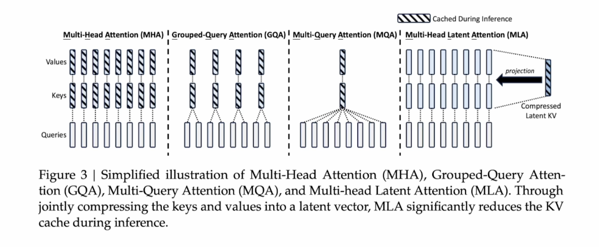

# DeepSeek-v3 技术报告

[技术报告](https://arxiv.org/pdf/2412.19437)  

## kv cache 
现在大模型基本是decoder结构，是自回归模型。它是一个token一个token生成，并且每次大模型的输入是之前所有的输出，
所以每次都要计算之前所有的token的attention。为了避免重复计算，使用了kv cache。基本思路是用空间换时间

**kv cache缓存的是k和v经过$w_k,w_v$矩阵计算后的结果，attention计算时会复用这个结果**

不过kv cache占用大量空间，MLA的思路就是减小kv

## MLA

### MLA的kv cachae

Attention就是通过矩阵相乘的形式计算token之间的关系，MLA就是在这个基础上进行改进的。

$$q_t=W^Q h_t$$

$$k_t=W^K h_t$$

$$v_t=W^V h_t$$

同一个头$h_t$($h_t$按照列来concatenate,目的是捕捉同一个token的不同特征)，经过模型训练过的$W^Q,W^K,W^V$
转换成为$q_t,k_t,v_t$进行attention计算

多头注意力机制将$q,k,v$扩展为三维

$$[q_{t,1};q_{t,2};···;q_{t,n_h}]=q_t$$

$$[k_{t,1};k_{t,2};···;k_{t,n_h}]=k_t$$

$$[v_{t,1};v_{t,2};···;v_{t,n_h}]=v_t$$

$$o_{t,i}=\sum_{j=1}^tSoftmax_j(\frac{q_{t,i}^Tk_{j,i}}{\sqrt {d_h}})v_{j,i}$$

这里$n_h$是总头数

传统的多头注意力机制，需要将所有的k和v cache起来

GQA的思路是，将k和v数量减少，比如两个q共用一个k和v

MQA的思路是一个k,v就可以把所有的q都计算出来了

MLA的思路是将k和v进行压缩，压缩到更小的空间，称为latent kv，我们在cache时，只需要cache latent kv就可以了。
latent kv是通过一个线性变换得到的，latent kv的维度比k和v小很多

我们要引入中间变量$c_t^{KV}=W^{DKV}h_t$,这里的$W^{DKV}$是一个线性变换矩阵，$c_t^{KV}$的维度比$k_t$和$v_t$小很多，我们要cache c

$$k_t^{KV}=W^{UK}c_t^{KV}$$

$$v_t^{KV}=W^{UV}c_t^{KV}$$

在模型做inference时候，不需要单独算$W^{UK}和W^{UV}$，它们会融入到一个参数矩阵里

$$q^T=(W^Qh)^T$$

$$k^c=W^{UK}c^{KV}$$

$$q^Tk^c=(W^Qh)^TW^{UK}c^{KV}=h^T[(W^Q)^TW^{UK}]c^{KV}=h^TW'c^{KV}$$

我们就只需要训练W'就行了

同样对k和v，我们在训练时也不需要计算$k^c和v^c$,只需要计算c就行了

作者又对q进行了压缩，q的维度也比k和v小很多

$$c_t^{Q}=W^{DQ}h_t$$

$$q_t^c=W^{UQ}c_t^{Q}$$

**注意：这里压缩q的中间变量c跟kv的c不一样**

### MLA的位置编码
如果同一个token在不同位置，corelation就会不一样，位置编码的作用是帮助模型理解token之间的相对位置关系

传统的位置编码包括absolute position embedding和relative position embedding

absolute position embedding是对每个token进行位置编码，relative position embedding是对每个token之间的相对位置进行编码

#### 绝对值位置编码
比较简单，但是inference的时候，长句子的效果不好

#### 相对位置编码
长序列处理能力较强，计算复杂度较高，计算量大，泛化性好

#### RoPE=绝对位置编码+相对位置编码 

MLA的思路是对每个token进行位置编码，使用的是相对位置编码，有效地解决