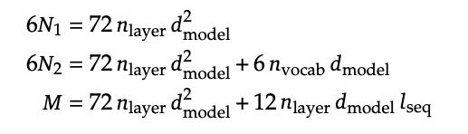

# Deepseek：基座模型发展

Deepseek目前主要关注两条技术路线：一个是base模型的突破，另一个是模型reasoning的performence。本文会整体把Deepseek的系列论文过一遍，然后highlight一些重要技术。

这一篇文章更多关注于基座模型的发展。


## **DeepSeek LLM**

[Deepseek LLM: Scaling Open-Source Language Models with Longtermism](https://arxiv.org/abs/2401.02954)

这是DeepSeek 的第一篇大模型工作可以看作是其在大语言模型领域的“横空出世”之作。这篇paper并非以创新为主，而是对 Meta 的 Llama 2 模型的一次高质量复现。当时Llama 2 发布不久，作为初创公司的 DeepSeek 选择从复现入手，是非常合理且务实的选择。
所以它们的目标是验证自身能否成功 reproduce 出 Llama 2 的性能，并在此基础上进行后续迭代。


### 一、核心技术路线与实现方式

#### 数据部分

- **中英双语支持**：DeepSeek 模型是面向中英文混合训练的，这与纯英文的 Llama 2 不同。

- **数据质量更高**：虽然整体流程 follow Llama 2，但在数据清洗和构建上投入更多精力，提升了数据集的质量。

#### 模型架构

**完全复用 Transformer 架构**：包括model architecture、初始化方法、training等均与 Llama 2 一致。

**两种规模版本**：

  - 7B 参数版本（对标 Llama 2 的 7B）

  - 67B 参数版本（对标 Llama 2 的 70B）

#### 训练策略

- **预训练总量**：约 2T token，与 Llama 2 的训练量相当。

- **后训练阶段（Post-training）**：

  - 包括 SFT（监督微调）和 DPO（偏好优化），流程与主流做法一致。


### 二、性能表现与对比

- **超越 Llama 2**：论文中提到 DeepSeek 在多个评测任务上超过了 Llama 2 270B 的效果。

主要归因于数据质量的提升，而非模型结构上的重大改进

### 三、改动细节


#### 1. **学习率调度策略的改进**


关于在Learning Rate Schedule的选择上，Llama 2选择Cosine Learning Rate Schedule，但Deepseek选择Multi-step Learning Rate Schedule


**Cosine Learning Rate Schedule**

- **核心思想**：学习率从初始值开始，按照余弦函数的形状逐渐下降到一个最小值（通常是 0 或接近 0），然后再可能回升（如果是周期性 Cosine）。

**公式形式（单周期）**：

  $$
  \eta_t = \eta_{min} + \frac{1}{2}(\eta_{max} - \eta_{min}) \cdot \left(1 + \cos\left(\frac{T_{cur}}{T_{max}} \pi\right)\right)
  $$
    
- $\eta_t$：第 t 步的学习率

- $\eta_{max}$：初始学习率

- $\eta_{min}$：最低学习率

- $T_{cur}$：当前训练步数

- $T_{max}$：总训练步数

**特点**：

    在训练初期下降慢，后期下降快；
    需要提前设定好总的训练步数（或 epoch 数）；
    如果中途更改数据量或训练计划，难以灵活调整。
 
---

**Multi-step Learning Rate Schedule**

- **核心思想**：在预设的几个训练阶段（epoch 或 step 点）将学习率按一定比例降低（如乘以 0.1），通常采用常数段+跳跃式下降的方式。
- **示例设置**：
  ```python
  milestones = [30, 80]  # 在第 30 和 80 个 epoch 时降低学习率
  gamma = 0.1            # 每次降低为原来的 1/10
  ```

- **特点**：
  - 每一段学习率是固定的；
  - 更容易根据训练情况手动干预；
  - 不依赖于总训练步数，适合动态调整训练计划；
  - 实现简单，广泛用于目标检测、图像分类等任务。

---


**DeepSeek 为何选择 Multi-step？**

大模型训练过程中，数据可能会动态更新（比如新增高质量数据），导致原定的训练步数发生变化。Cosine 调度一旦设定就无法轻易更改，否则会影响学习率曲线，影响收敛。
Multi-step 更加灵活，可以在不同阶段手动或自动调整学习率下降时机，而不破坏整体训练节奏。
不过虽然学习率变化方式不同，但最终性能与 Cosine 接近，根据figure 1说明这种改动是有效且实用的。


#### 2、Scaling Law 与 超参数研究

**Skilling Law（缩放定律）** 是一种经验公式或预测函数，用于指导在给定算力预算下，如何选择最优的模型大小、数据量和训练策略，以获得最佳性能。

其本质是回答这个问题：

  > “如果我有 X 算力资源，我应该训练多大的模型、用多少数据、设置怎样的超参数才能得到最好的效果？”

- 比如你有 1000 张 A100 GPU 卡，只能使用三个月，你想知道：
  - 应该训练一个 70B 的模型还是 130B？
  - 配套训练多少 token 数据最合理？
  - 学习率、batch size 等怎么设置？

这些都会影响模型的训练速度、效果，如果你的算力是固定的，那么必然会有个最优的config，我们发现了这种Scaling law，那么就可以通过小模型实验，推测大模型的最佳config，从而节约成本


Deepseek在这篇paper上做了关于Scaling law的research，而且比起之前的Scaling law做了更深入的研究。


- 以往的 Scaling Law（如 Chinchilla、Llama 2）主要关注：

    - 模型大小（model size）
    - 数据总量（data size）

DeepSeek 则首次将 **超参数（learning rate, batch size 等）** 也纳入 Scaling Law 的研究范围。


论文中 Figure 3 展示了：

    随着算力增加，最优的 base size 和 learning rate 如何变化；

    这些关系呈现出幂律（power law）形式；

    可以从小规模模型外推到大规模模型。


- 之前的方法（如 Chinchilla）在估算算力需求时，仅考虑了模型层数、参数数量等基础因素；

- DeepSeek 指出这些方法忽略了 Transformer 中注意力机制带来的“计算开销”，因为在进行注意力计算时，它的复杂度为$O(T^2\cdot D)$,T为序列长度，D为模型维度，这部分注意力计算在传统的Scaling law被忽略了

- 因此他们提出了一个新的公式（论文中的 Equation 2），更精确地建模实际所需的 FLOPs（浮点运算次数）；




我觉得Deepseek的team很有想法，很多业界团队在复现 Llama 2，要么直接照搬其超参数配置，要么只是做少量调参就完成任务；

而 DeepSeek 的做法更像是科研团队的做法，我应该怎么设置超参数，将其转化为一个科学问题进行建模，不满足于哪一个超参有效果，更追求为什么有效，然后建立一个Scaling law


- **横轴**：表示算力（FLOPs），即浮点运算次数，可理解为使用多少张 GPU 训练了多长时间（如 1000 张卡训练 1~3 个月）。
- **纵轴**：模型性能（loss），越低越好。
- **灰色小点**：是通过小规模模型训练得到的实验结果（少量算力训练出的小模型）。
- **虚线拟合曲线**：基于这些小模型拟合出的 Scaling Law 曲线，用于预测大规模模型的效果。


Deepseek提出了更精确的公式 $ C = MD $

- 传统公式：$ C = 6ND $，忽略注意力机制带来的额外开销；

- DeepSeek 新公式：$ C = MD $，其中 $ M $ 表示每个 token 的平均计算成本（FLOPs/token），并考虑了注意力机制的平方级复杂度；


然后他们明确指出“注意力机制”的高阶复杂度影响

- 注意力机制的计算复杂度为 $ O(T^2 \cdot D) $，随着序列长度增长呈平方增加；
- 传统方法低估了这部分开销，导致资源配置不准确；
- DeepSeek 强调这种“conversational overhead”应被纳入模型配置决策中 。

---

### 3、对 Data Quality 的新洞察


以往 Scaling Law 假设所有数据质量一致，DeepSeek 提出不同数据质量会导致不同的最优模型与数据配比，即使算力相同，高质量数据可以支持更大模型或更少数据量 。


- DeepSeek 从一开始就注重数据质量，这也是其模型性能优于同期模型的重要原因之一；

- 表明 Scaling Law 不只是“暴力美学”，而是需要结合数据、模型、训练策略的综合优化 。

---


还有一点就是Deepseek对“刷榜”这件事也做了一些诚实的探讨，当时大模型研究比较浮躁，人们更多关注llm在榜单上的表现，而模型在榜单上的表现其实和在真实应用的时候会存在一个gap。

比如说Deepseek针对考试题型进行微调后，原本47分的模型可以升到71分，坦诚地告诉读者，我们模型真正的能力并不那么强。


## Deepseek MOE

[DeepSeekMoE: Towards Ultimate Expert Specialization in Mixture-of-Experts Language Models](https://arxiv.org/abs/2401.06066)

这是DeepSeek第二篇文章，讲的还是基座模型，不过这时就改成了MOE模型

### Dense Model与 MoE

#### 1. **基本架构差异**

- **Dense Model**：传统的 Transformer 模型，每一层的计算都使用所有参数。无论输入是什么类型的数据，整个网络的所有部分都会参与计算，因此称为“稠密”。

- **MoE（混合专家模型）**：在 Transformer 的基础上，将某些层（通常是前馈网络 FFN 层）替换为 MoE 层。MoE 层由多个“专家”组成，每个专家负责处理特定类型的任务或数据。输入数据只会被分配给最合适的少数几个专家进行处理，其余专家不参与计算，因此是“稀疏”的。

#### 2. **计算效率**

- **Dense Model**：由于每次推理都需要激活全部参数，计算资源消耗大，尤其在模型规模较大时，训练和推理成本都很高。

- **MoE**：通过只激活少量相关专家，显著降低了计算需求。虽然模型整体参数量可能非常大（如数千亿甚至万亿），但实际每次推理只需用到其中一小部分，从而大幅降低推理成本。

#### 3. **模型扩展性**

- **Dense Model**：随着模型规模增长，训练和推理成本呈线性上升，难以有效扩展。

- **MoE**：允许构建超大规模模型，同时保持较低的推理成本。这种特性使得 MoE 成为当前大型语言模型（LLM）的重要发展方向之一。

---

**为什么选择 MoE？其核心优势是什么？**

1. **高效利用计算资源**：

MoE 允许模型在拥有大量参数的同时，仅激活与当前任务相关的部分参数，从而减少不必要的计算开销。这使得部署超大规模模型成为可能，而不会导致推理速度过慢或成本过高。

2. **提升模型性能**：

每个专家可以专注于特定类型的输入或任务，提升了模型在不同领域中的表现。相比单一的稠密模型，MoE 能更好地适应多样化任务。


这里Deepseek MoE 16B模型只激活了2.7B的参数，性能就与LLaMA2 7B的性能差不多

3. **支持更大模型规模**：

通过稀疏激活机制，MoE 可以构建参数量极大的模型（如 DeepSeek 的 MoE 模型达到 1.6 万亿参数），同时保持较高的推理效率。

4. **降低成本**：

尽管模型整体参数量庞大，但由于每次推理只激活部分专家，因此硬件要求和能耗都大大降低，适合实际应用部署。

5. **天然适合做分布式训练**

因为你分成不同的专家，那么这些专家就可以分别分配gpu，能更好利用多卡训练，下面是一些挑战。

**专家平衡（Expert Balance）**

- MOE 模型训练过程中，必须确保各个专家都被充分使用，避免某些专家“被冷落”。
- 如果只有少数专家被频繁调用，而其他专家几乎未被激活，会导致模型实际能力受限，相当于浪费了额外参数 。

**设备间负载均衡**

- 在大规模分布式训练中（如使用数千张 GPU），不仅需要平衡专家之间的使用频率，还需要确保不同 GPU 之间的负载均衡。
    - **GPU 利用率最大化**：防止只使用少数几张卡，导致整体集群效率低下；
    - **通信效率优化**：减少不同设备间的通信延迟，提升整体训练吞吐 。


---

### **DeepSeek MoE 的核心创新点**


#### 1. **专家数量显著增加，提升稀疏性与模型性能**

- DeepSeek 在其 MoE 模型中大幅增加了专家（expert）的数量，远超以往常见的 8 或 16 个专家的设定。他们尝试使用 64、128 甚至更多专家。
- 这种做法使得每次推理时激活的专家比例更小，从而提升了模型的**稀疏性**，降低了计算成本。
- 更多的专家意味着每个专家可以学习到更细分、更专业化的知识，增强了模型的表达能力与泛化能力。
- 相比之下，传统 MoE 设置中专家数量较少，导致不同专家之间的功能区分不明显，学习内容重叠度高 。

#### 2. **引入共享专家（Shared Expert）机制**
- DeepSeek MoE 引入了一个新的组件：**共享专家（shared expert）**，即无论输入内容是什么，都会经过这一部分处理。
- 共享专家主要负责处理通用的语言理解任务，例如基础语法、语义解析等，适用于所有类型的输入。
- 与之相对的是“路由专家”（routed expert），它们只在特定类型的任务或输入到来时被激活。
- 这一设计提高了模型对通用语言能力的掌握，同时保留了针对特定任务的专业处理能力，形成了一种“通专结合”的架构 。

DeepSeek 首先在小规模模型上验证 MoE 架构的有效性，随后将其扩展到更大模型。但是有可能在小模型上表现很好的方法，refer在参数量更大的模型上有可能并不work，所以Deepseek这种大胆的尝试很需要勇气。

---


DeepSeek 尝试训练了一个 **145B 的 MoE 模型**，训练数据量仅为 200B的Token（远低于常规的 2 T token），说明Deepseek在训练中途，发现新架构比较work，这一点会在v2进一步完善。
尽管该模型尚未完全训练完成，但这一实验验证了 DeepSeek 的 MoE 设计理念具备极大的潜力。纵观全文，其实Deepseek很看重成本的问题，这一点在v2、v3和R1的论文都有体现。

## Deepseek-v2

[DeepSeek-V2: A Strong, Economical, and Efficient Mixture-of-Experts Language Model](https://arxiv.org/abs/2405.04434)

Deepseek v2可以看作是上面那一篇paper的scale up，不过也有一些非常重要的技术。从论文名字可以看出来“A Strong, Economical, and Efficient”，他们提出了进一步降低成本的技术

DeepSeek-V2 是236B的混合专家模型（MoE），每个 token 激活21B，极大降低了推理成本 。相比第一代的 DeepSeek 67B，虽然模型规模更大（接近其4倍），但激活参数更少，推理效率更高 。

**训练与推理成本优化**


- **训练成本降低 42.5%**：相比 DeepSeek 67B，DeepSeek-V2 在保持更强性能的同时，显著减少了训练所需的计算资源 。
- **KV 缓存减少 93.3%**：通过引入新的注意力机制 Multi-head Latent Attention（MLA），大幅压缩了 KV 缓存需求，从而降低了部署和推理成本 。
- **生成速度提升 5.76 倍**：在相同硬件条件下，DeepSeek-V2 的输出速度远超前代模型，提升了实际应用中的响应效率 。

 **Multi-head Latent Attention（MLA）**

- 这是 DeepSeek-V2 引入的一项关键技术，用于替代传统的多头注意力机制
- MLA 通过引入潜在空间（latent space）进行注意力计算，减少了计算复杂度和内存占用，进一步提升了推理效率 
- 它不仅降低了 KV 缓存的需求，还使得模型能够支持更大的 batch size，从而提升整体吞吐量

DeepSeek-V2还支持 **最长 128K tokens** 的上下文长度


---


### **MLA**

- MLA 引入了一个 **潜在空间（latent space）**，将原始的高维 Key 和 Value 向量映射到一个低维空间中进行存储。
- 具体来说，模型先计算一个低秩的“压缩表示” $ C $，然后在需要时通过矩阵变换恢复出 Key 和 Value：
  $$
  K = W_K \cdot C, \quad V = W_V \cdot C
  $$
- 这种方法被称为 **Low-Rank Key-Value Compression**，大幅减少了存储需求，从而降低了 KV Cache 的占用 。

 **MLA 与其他注意力机制的对比**

| 方法 | 头数 | Key/Value 存储方式 | KV Cache 占用 | 性能影响 |
|------|------|---------------------|----------------|------------|
| **MHA（多头注意力）** | 多头 | 每个头独立存储 | 高 | 最佳 |
| **GQA（Grouped Query Attention）** | 多组共享 | 组内共享 Key/Value | 中等 | 稍有下降 |
| **MQA（Multi-Query Attention）** | 单头 | 所有头共享 Key/Value | 低 | 明显下降 |
| **MLA（Multi-Head Latent Attention）** | 多头 | 压缩后的潜在向量 | 极低 | 接近 MHA |

- MLA 在保持多头注意力灵活性的同时，通过低秩压缩实现了接近 MQA 的显存效率，且性能损失极小 。


### **KV Cache**

- 在传统的 Transformer 模型中，**多头注意力机制（MHA）** 需要存储大量 Key 和 Value 向量（即 KV Cache），以加速生成过程中的自回归推理。
- 这些向量的存储会占用大量 GPU 显存，尤其是在处理长上下文时，成为部署成本的主要瓶颈。
- DeepSeek-V2 提出 **Multi-Head Latent Attention（MLA）**，旨在通过压缩 KV Cache 来显著降低推理时的显存占用和计算开销。

**KV Cache 压缩效果**
- 实验表明，MLA 可将 KV Cache 减少 **93%**，使得模型在长文本生成任务中更加高效。
- 例如，在生成 128K token 的任务中，MLA 显著降低了内存占用，提升了吞吐量和响应速度 。


**说一下为什么kv cache不cache q，q不是也包含历史信息了吗，怎么不把q缓存一下？**

因为transformer是自回归模型，每一次的结果都被当成新的q，所以缓存起来没意义，它只用一次，是动态变化的。而k和v则是需要经常复用，所以每次模型输出结果后，只需要把最新的token向量拿出来，进行权重矩阵计算后，直接和缓存后的k和v拼接在一起，
而不像以前需要每个token进行权重矩阵的重复计算。所以kv cache节约的是，k和v与对应权重矩阵的计算。


**与 GQA 的对比**

- 传统的 GQA通过共享部分head来减少 KV Cache 的大小。例如，16 个头分成 4 组，每组共享 K/V。
- MLA 相当于使用了 **约 2.25 个 group 的 GQA**，但性能远优于同等 group 数量的 GQA，即在更小的显存消耗下保持了更高的模型效果 。

---

### 小结

| 方面 | DeepSeek 的做法 |
|------|----------------|
| 注意力机制 | 提出 MLA，显著压缩 KV Cache，提升推理效率  |
| MoE 架构 | 使用大量专家（如 160 个），提升稀疏性和模型表达能力  |
| 平衡策略 | 注重专家和设备间的负载均衡，提高训练效率和资源利用率  |


## Deepseek-v3

[DeepSeek-V3 Technical Report](https://arxiv.org/pdf/2412.19437)

这篇是Deepseek正式受到大量关注的论文，可以看作是v2的scale up，参数规模达到671B，是当时非常出名的 DeepSeek-R1 的基座模型。相比前代 DeepSeek-V2（236B），V3 模型规模接近三倍，训练 token 数量达到 14.8T，远超 V2 的 8.1T 。


该模型在架构上延续了 V2 的核心设计，包括：

- 使用 **Multi-Head Latent Attention（MLA）** 技术，显著压缩 KV Cache；
- 延续 **MoE 架构**，大量专家（expert）设计提升稀疏性和模型表达能力；
- 每个 token 只激活 21B参数，保持低推理成本的同时实现高性能 。

尽管模型规模巨大，DeepSeek-V3 的训练成本却非常低廉，使用 **2300 张 H800 GPU**，训练时长为 **2300 GPU 小时**；总花费仅 **557万美元**，远低于同期其他开源模型，如 Llama 3.1 400B 的训练成本高达 **3000万美元以上**，差距达 **6 倍以上** 。


### **DeepSeek-V3创新点**

#### 1. **Loss-Free Balancing：无需额外损失函数的专家平衡机制**

- DeepSeek 在 MoE 模型训练中提出了一种 **loss-free balancing** 方法，用于解决不同专家之间使用不均衡的问题。

- 该方法通过监控每个专家的使用频率，并动态调整其被选中的概率。例如，如果某个专家被频繁使用，系统会自动降低它的优先级，从而实现负载均衡。

- 这是一种 **轻量、直观且无需修改目标函数** 的工程优化方式，相比传统引入新损失函数的方法更为简洁高效 。

#### 2. **Multi-Token Prediction（MTP）：一次预测多个 token**

- DeepSeek-V3 引入了 **Multi-Token Prediction** 技术，即在训练时不仅预测下一个 token，还同时预测后续多个 token。

- 这一做法增强了模型对未来语义的建模能力，使其具备“提前规划”的能力，有助于提升生成质量与连贯性。

- 虽然这一技术来源于一篇非主流论文，但 DeepSeek 是首个在 **超大规模 MoE 模型上成功应用 MTP 的公司**。

#### 3. **推理阶段的 speculative decoding 应用潜力**

- MTP 的设计使得模型具备 **一次生成多个 token 的可能性**，这为后续部署 speculative decoding 提供了基础。

- speculative decoding 是一种加速生成的技术，允许模型并行预测多个 token，再由另一个模型进行验证或修正，从而显著提升生成速度。

- 尽管目前尚未明确是否已在产品中全面部署该机制，但 V3 的架构为其提供了可行性支撑 。

---

**小结**

| 特性 | DeepSeek-V3 表现 |
|------|----------------|
| 模型规模 | 6710亿参数，当前最强基座模型之一 |
| 成本控制 | 训练成本仅 557万美元，远低于 Llama 等模型 |
| Loss-Free Balancing | 动态专家负载均衡，无需额外损失函数 |
| Multi-Token Prediction | 首次在大规模 MoE 上应用，提升生成质量和效率 |


### **FP8 低精度训练**

DeepSeek-v3使用 FP8（8 位浮点数）进行**低精度训练**，以提升训练速度和降低计算成本。而传统训练中使用的是 FP32 或 FP16，精度更高但资源消耗大。


但是低精度表示可能导致训练不稳定、模型效果下降。之前多用于部署阶段的量化（如推理），但在大规模训练中成功案例极少。

DeepSeek V3 是最早在**大规模语言模型训练中成功应用 FP8** 的公开项目之一。

---

### **MOE（Mixture of Experts）路线坚持**
- 从 DeepSeek-MoE 到 V3，始终坚持使用大量专家（Expert）。
- 相比之下，Llama 系列（如 Llama 3）仍未采用 MoE 架构。部署成本是Deepseek十倍多

**V3 架构特点**

- 包含 1 个共享专家 + 256 个专属专家。V2（2 个共享专家 + 160 个专属专家）

### DeepSeek-v3后训练


**SFT 数据量极小**

- DeepSeek V3 的 SFT仅使用了 **150万条数据**（1.5M），相比 Llama 3 的 10M–20M 条数据量来说非常少。
对于一个 600B 参数级别的模型来说，这个数据量极其精简。

**使用蒸馏生成数据**

- **Reasoning 数据**通过内部未公开的 DeepSeek R1 模型进行蒸馏生成。R1 是在 V3 基座基础上开发的推理模型，反过来用于蒸馏训练 V3 的 chat 版本。
这是一种“自蒸馏 + 内部迭代”的方式，在当时尚未对外公开。

**Long Reasoning 数据来源**

- 使用 DeepSeek V2.5（即 DeepSeek V2 的优化版本）生成长推理数据。
- V2.5 相比 V2 在数据或模型层面做了进一步优化，性能略优。

** 强化学习策略**

- 引入 GRPO（一种强化学习算法），用于提升推理能力。
- 对于可验证任务（如数学、编程）采用**规则奖励机制**（是否正确）。
- 对开放性问题使用传统奖励模型（reward model）。
- 这种混合奖励机制是 DeepSeek 策略上的重要变化，区别于早期完全依赖模型打分的方式。


最终部署版本（Chat 版本）经过蒸馏和 RL 训练后效果显著优于基座模型（Base Model）。
尽管后训练投入相对较少，但整体表现依然优异，尤其在中文、代码、数学等任务上超越 Llama 3 的 405B 模型。

DeepSeek V3 的训练策略和后训练设计并不以“刷榜”为导向。相较于其他公司对榜单分数的高度关注，DeepSeek 更注重**工程实现、成本控制与实际应用价值**。即使在 SFT 和 RL 阶段也没有大量优化榜单数据或嵌入特定提示。

这家公司更倾向于技术探索和系统性创新（如 FP8 训练、MOE 架构、多 token 预测等）。


---

这是DeepSeek基座模型的发展路线。从 DeepSeek-MoE 到 V1、V2、V3，持续优化 MoE 架构，降低成本并提升性能。