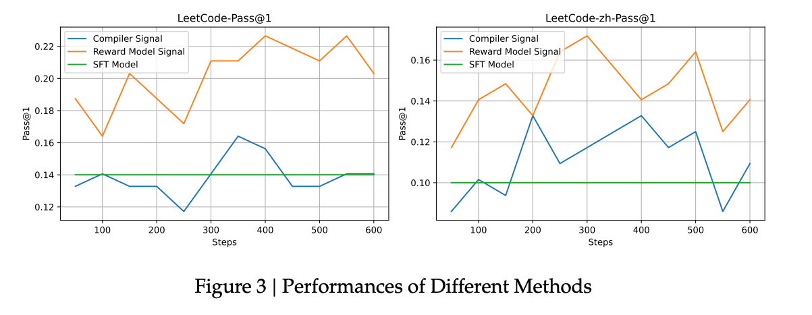
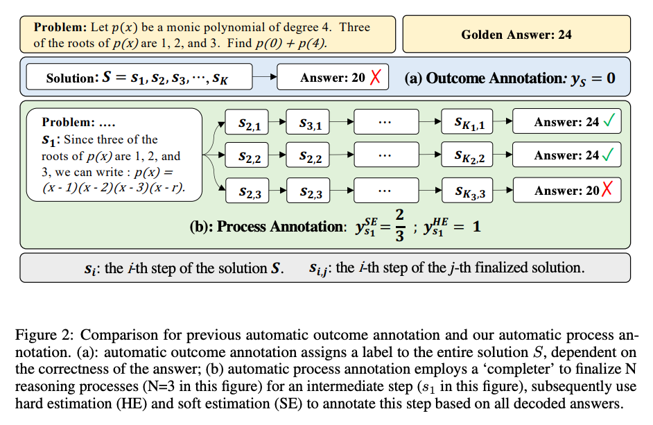
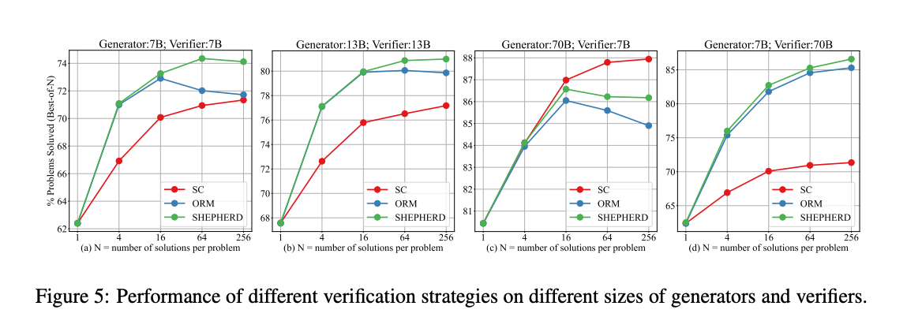
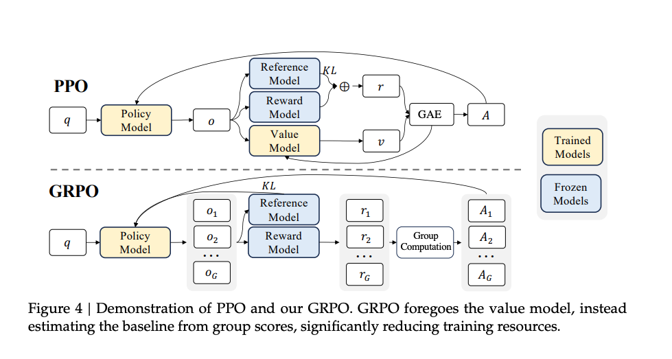
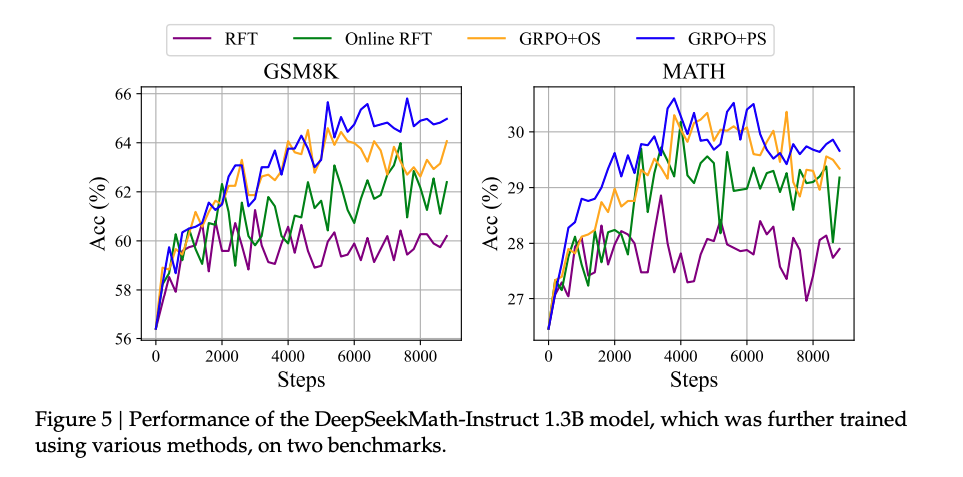
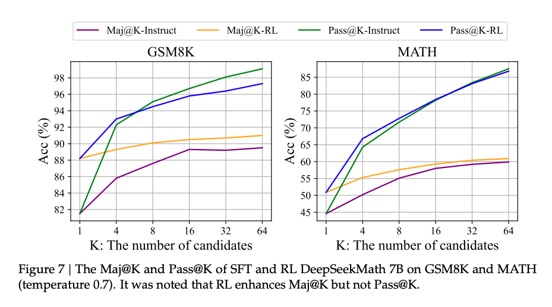
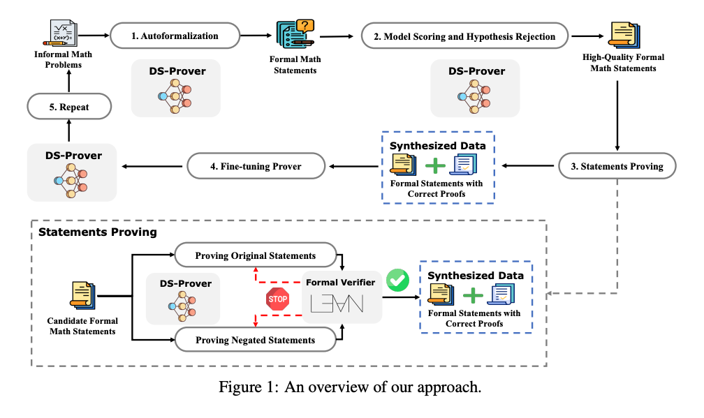
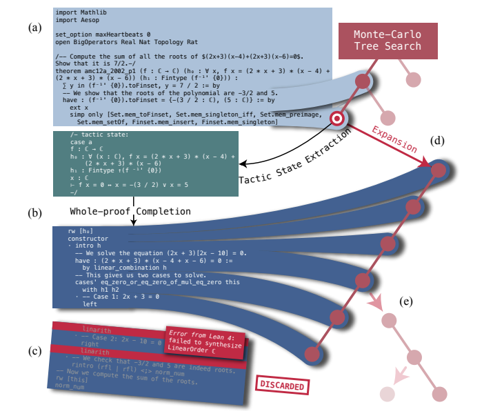

# DeepSeek:Reasoning

## DeepSeek-Coder

[DeepSeek-Coder: When the Large Language Model Meets
Programming - The Rise of Code Intelligence](https://arxiv.org/pdf/2401.14196)

DeepSeek 最早开始探索 reasoning 能力是在 **2024 年初**。

### **DeepSeek Coder V1**

- 模型结构：**稠密模型（Dense Model）**
- 基础架构：与 DeepSeek 第一代通用模型相同（类似 LLaMA 2）
- 训练数据：**全部为代码数据**（非通用文本）
- 参数规模：从 **1.3B 到 343B** 不等
- 特点：开源，适用于多种代码场景

### **DeepSeek Coder V1.5**

- 在 V1 基础上继续训练（即 **Continue Pre-Training**）
- 使用额外 **2T token 数据**，其中约 70% 为代码数据，其余为辅助语料
- 目标：在已有通用基座基础上增强代码能力
- 区别于“从头训练”的方式（Scratch Training）

### **对 reasoning 的推动作用**

虽然不是专门设计的 reasoning 模型，但代码任务本身具有强逻辑性和推理属性，社区普遍认为：**代码训练有助于提升通用 reasoning 能力**

## DeepSeek-Coder-v2

[DeepSeek-Coder-V2: Breaking the Barrier of Closed-Source
Models in Code Intelligence](https://arxiv.org/pdf/2406.11931)

DeepSeek Coder V2 是 DeepSeek 在代码模型方向上的进一步迭代。**开始采用 MoE 架构**，基于 DeepSeek V2 的通用 MoE 基座继续训练。

- 训练方式：在已有基座基础上，继续使用 **6T token 数据**进行训练，其中以代码为主。
- 可视为 DeepSeek V2 的“代码增强版”。

### Reward Model

#### **使用Reward Model 的原因**

- 尽管代码任务具有可验证性（如 unit test、是否编译通过等），但 DeepSeek V2 在训练时仍选择使用了 **Reward Model（奖励模型）**。
- 理由：
  - Unit test 不够全面或存在噪声（noisy feedback）。
  - 某些场景下，错误的代码可能恰好通过测试用例，导致反馈不准确。
  - 因此认为仅靠规则反馈（0/1 判断）不够可靠。

- DeepSeek 做了一个对照实验：
    - **绿色线（SFT）**：仅监督微调，效果一般。
    - **蓝色线（Rule-based）**：使用规则反馈强化学习，效果不稳定。
    - **橙色线（Reward Model）**：使用奖励模型进行强化学习，表现更优。

2024 年初至年中，整个社区普遍倾向于使用 reward model。

- 但从后续发展来看（如 DeepSeek R1 ），DeepSeek 开始转向 **基于规则的 reward system**。

首先是，Rule-based 方法在 scale up 时更稳定、更可控。其次，Reward model 容易过拟合特定数据分布，泛化性较差。

## Math-Shepherd

[Math-Shepherd: Verify and Reinforce LLMs Step-by-step without Human Annotations](https://arxiv.org/pdf/2312.08935)

这篇论文并非是那种“发布大模型 + benchmark 刷榜”的工业界典型论文。更像是**学术研究性质的对照实验论文**，虽然规模不大，但具有开创性意义。

OpenAI 发布了论文[Let’s Verify Step by Step](https://arxiv.org/pdf/2305.20050)，首次提出**过程监督**的概念。
引导使用奖励模型来监督推理过程中每一步是否正确，而非仅看最终结果。

所以OpenAI 使用人工标注了大量数学解题数据（PRM800K），用于训练 PRM 模型，成本高昂。

于是DeepSeek 提出了一个无需人工标注的方案，**完全自动生成过程监督数据**。

- 基本方法：
    - 对于某个数学解题步骤（如第二步），固定该步骤后继续生成后续多个路径。
    - 如果后续路径中大多数能推导出正确答案，则认为该步骤是对的；否则视为错误。
    - 通过这种方式反向判断每一步的对错，构建训练数据。

DeepSeek完全去除了对人工标注的依赖,使得可大规模自动化生成训练数据，实验证明效果与人工标注接近，甚至相当。

---

**过程监督 vs 结果监督 vs 多数投票**

| 方法 | 描述 | 特点 |
|------|------|------|
| 多数投票 | 生成多个答案，取多数票作为最终答案 | 不需要 reward model，成本低，效果一般 |
| 结果监督 | 仅监督最终答案是否正确 | 成本适中，忽略中间逻辑 |
| 过程监督 | 监督每一步是否正确（过程监督） | 效果最好，但生成成本高 |

- 横坐标：生成样本数（如 64 个）
- 纵坐标：准确率

结论：

- **Shepherd（绿色线）表现最优**，说明过程监督更有效。
- 这张图也体现了早期“test-time compute scaling”（测试时算力扩展）的思想。
- 类似今天 o1 所使用的“思维链采样 + reward 模型筛选”机制。

>这篇论文首次实现了**全自动构建过程监督数据集**，解决了人工标注成本高的问题。在推理能力提升路径上具有里程碑意义。
也为后续一篇更重要的paper作好了铺垫

## DeepSeekMath

[DeepSeekMath: Pushing the Limits of Mathematical
Reasoning in Open Language Models](https://arxiv.org/pdf/2402.03300)

DeepSeek Math 是一个**专用于数学推理的模型系列**。其中最核心的是 **DeepSeek Math 7B（DeepSeek MATH）**。

模型基于 **DeepSeek Coder Base V1.5 的 7B 模型**进行继续预训练。

- 使用了约 **120B token 的高质量数学相关数据**。
- 没有使用人工标注数据，而是通过自动构建的数据集进行训练。

- 在当时是开源社区中**表现最好的 7B 级别数学模型**。
- 性能优于 LLaMA、Mistral 等同级别模型，甚至超过部分更大规模模型（如 LLaMA 34B）。
- 虽未开源训练数据，但**模型本身开源**，受到广泛使用和研究。

### **GRPO：DeepSeek 提出的新型强化学习方法**

**动机：PPO 成本过高**

- PPO是经典的 RL 方法。

- 但在大模型场景下存在显著缺点：
    - 需要额外的 value model（价值模型）来计算 advantage。
    - 所有模型（policy、reward、reference、value）都需要加载到显存中。
    - 训练成本高，资源占用大。

### **GRPO**
- **GRPO** 是 DeepSeek 自研的轻量级强化学习算法。

- 关键创新：
    - **去掉了 value model**，改用多采样 + reward 平均作为 baseline 来估计 advantage。
    - 显著降低训练资源消耗，提升训练效率。

- 适用于在线强化学习（online RL），适合在推理过程中持续优化模型。

采用**自监督生成 + 多路径采样 + 结果反推**的方法自动标注推理步骤对错。**无需人工标注**，通过模型自身生成和验证完成数据标注。

**奖励模型类型**

- 使用**基于过程监督的奖励模型**，关注中间推理链准确性。
- 对比仅监督最终答案的，过程监督模型表现更优。

**Online vs Offline 强化学习的对比**

- **Offline RL**：用固定模型生成数据集后训练，数据不随模型更新（如 RFT）。
- **Online RL**：模型动态生成数据并实时更新，数据随模型迭代变化（如 GRPO）。
- **Interactive（迭代式）**：介于两者之间，定期更新数据集但迭代次数有限。

- **主流仍为 Offline**：如 Llama 3 的后训练主要采用 RFT（拒绝采样）。
- **Online 尚未普及**：因资源消耗大、稳定性差、开源工具链不成熟（如 DeepSeek 未开源训练代码）。

- **Pass@1 表现优异**：强化学习模型在单次采样中正确率显著提升（如蓝色线）。
- **Pass@K 下降**：当采样 K 个响应时，模型探索能力反而下降（如绿色线），暗示**强化学习仅优化排序而非根本能力**。

**DeepSeek 的诚实结论**：明确指出改进源于“提升正确答案排序”，而非“增强基础推理能力”。

- DeepSeek 在论文中明确指出：“The improvement is attributed to boosting the correct response, rather than enforcement fundamental ability.”   
  意思是：强化学习并没有让模型掌握新的推理逻辑或知识，而是让它更擅长从已有能力中选出正确答案。
- 这与一些人对 RL 的预期不同——很多人认为 RL 是“让模型学会自己思考”，但实际上它更像是“让模型更自信地选择正确的路径”。

> **这意味着**：RL 并没有显著提高模型“探索出正确答案”的能力，只是让已有的正确答案更容易被选中。

- DeepSeek 团队对此持非常开放和诚实的态度，他们没有因为 RL 提升了榜单分数就宣称“模型变得更聪明了”，而是客观指出其局限性。
- 这也引导了后来的研究方向：
    - 如何让模型真正提升基础推理能力？
    - 是否可以通过其他方式（如规则奖励、过程监督等）增强模型的探索能力？
    - 是否可以结合规则 + 模型的方式实现更有效的强化学习？

这些问题最终推动了 DeepSeek R1 和 DeepSeek 2.5 的进一步演进，其中引入了基于规则的奖励机制，取得了更好的推理效果 。

**强化学习的局限性**

- **泛化能力不足**：奖励模型在训练数据分布外（如大学数学题）表现较差。
- **稳定性与调参难度**：在线强化学习（如 PPO/GRPO）参数敏感，难以复现理想效果。

**1. 规则奖励的优势**

- **鲁棒性高**：适用于数学、代码等领域，仅依赖最终结果是否正确（如标准答案）。
- **泛化性强**：不区分任务难度（小学/大学），规则普适。

**2. 规则奖励的局限**

- **稀疏性问题**：仅提供最终结果反馈，缺乏中间步骤密集奖励（如自动驾驶的复杂决策）。
- **适用领域受限**：开放性任务（如写作）仍需奖励模型判断质量。

**DeepSeek 的路径选择**

- **当前依赖过程监督奖励模型**：如 DeepSeek Math 仍使用 GRPO + 过程监督。
- **转向规则奖励的趋势**：在 DeepSeek 2.5 等后续版本中，规则奖励成为主流。

- **过程监督模型的上限**：若能完善过程监督奖励模型，性能上限可能更高。
- **规则与模型的结合**：混合使用规则奖励与奖励模型，兼顾效率与灵活性。

## DeepSeek-Prover

[DeepSeek-Prover: Advancing Theorem Proving in
LLMs through Large-Scale Synthetic Data](https://arxiv.org/pdf/2405.14333)

### 一、核心问题：奖励模型的泛化能力

- **问题背景**：
  - 在基于强化学习（RL）的生成模型中（如使用PPO、GRPO等算法），**奖励模型（reward model）的泛化性是一个关键瓶颈**。
  - 奖励模型通常是基于人类偏好或人工标注数据训练出来的神经网络模型，容易出现过拟合或在复杂任务上表现不稳定。

- **影响**：
  - 导致强化学习过程中策略更新不准确，最终影响生成质量。
  - 尤其在需要强逻辑推理的任务（如数学定理证明）中更为明显。

---

### 替代方案：形式化定理证明引擎

- **引入背景**：
    - 为了克服奖励模型的局限性，研究者开始探索**可验证的形式化系统**，例如Lean、Isabelle等定理证明工具。
    - 这些工具可以作为一个“外部规则引擎”，判断一个数学命题是否被正确证明。

- **特点**：
    - 输入是**非形式化的自然语言数学问题**。
    - 输出是**形式化语言描述的命题与证明过程**。
    - 验证机制独立于神经网络，**完全依赖形式化逻辑和符号执行器**。

- **优势**：
    - 提供**客观、无歧义的反馈信号**。
    - 不依赖人工标注或奖励模型，具有更强的泛化性和稳定性。

---

### 三、DeepSeek Prover 的自我迭代方法

- **v1.0 版本（未使用强化学习）**：
    - 目标：将自然语言数学问题转化为形式化语言，并尝试自动完成定理证明。
    - 方法：采用**迭代式自我提升（Iterative Self-Improvement）**：
        1. 模型生成候选证明。
        2. 使用定理证明引擎（如Lean）验证结果。
        3. 正确样本加入训练集，用于下一轮训练。
        4. 循环往复，逐步提升性能。

- **关键点**：
    - 整个过程是**离线迭代（offline iteration）**，但已经展现出强大的潜力。
    - 类似于AlphaGo Zero中的自我对弈思想，但应用于形式化数学领域。

## DeepSeek Prover v1.5

[DeepSeek-Prover-V1.5: Harnessing Proof Assistant Feedback
for Reinforcement Learning and Monte-Carlo Tree Search](https://arxiv.org/pdf/2408.08152)

### 迭代式自我更新 vs 强化学习

DeepSeek Prover v1.0：基于定理证明引擎的迭代式自我更新

- 使用Lean等定理证明工具作为反馈机制。
- 模型生成候选证明 → Lean验证是否正确 → 正确样本加入训练集 → 循环迭代提升性能。
- **不依赖奖励模型**，而是使用**形式化系统提供的0/1二值反馈信号**。
- 属于**离线迭代（offline iteration）**方式 。

DeepSeek Prover v1.5：引入在线强化学习

- 方法上开始使用**GRPO算法**
- 相比v1.0，更强调**在线学习（online learning）**，实时生成并验证新数据。
- 同样没有使用传统意义上的奖励模型（reward model），而是直接利用定理证明器提供反馈 。

### Reward Model

- **早期观点**：通常认为强化学习中使用奖励模型能提升效果（e.g., 提供更细粒度的奖励信号）。
- **DeepSeek的选择**：他们发现虽然定理证明有明确的“通过/失败”反馈（binary reward），但这种反馈非常稀疏（sparse）。
- **解决思路**：
    - 不再训练额外的奖励模型。
    - 而是通过**筛选易解问题（cheap-to-validate）** 的方式来避免过于稀疏的反馈。
    - 这是一种绕开复杂奖励建模的方式，回归到最基础的可验证性反馈。

> 这种做法可以看作是从“需要奖励模型”向“规则可验证反馈”的一次“弯路绕回”，即重新回到一种更确定性的反馈机制。

### MCTS（蒙特卡洛树搜索）

- 在O1模型发布后，MCTS成为社区热议话题，被认为是OpenAI可能采用的关键技术之一。
- MCTS是一种在生成过程中构建决策树的方法，适用于多步推理任务。

- **DeepSeek Prover v1.5 的实践**：

    - 引入了MCTS的一种变体，称为**RMX-TS**。
    - 基本思想：不是逐字生成，而是在每一步生成时展开多个路径，模拟后续可能的结果，选择最优路径继续生成。
    - 用于提升定理证明的成功率和逻辑连贯性。

- **意义**：
    - 表明即使在高度结构化的数学推理场景中，也值得探索更复杂的解码策略。
    - 为后来的R1等模型提供了启发，尽管最终R1选择了更简化的路线 。

---

| 阶段 | 方法 | 是否用RL | 是否用Reward Model | 是否用MCTS | 关键点 |
|------|------|-----------|---------------------|-------------|--------|
| DeepSeek Prover v1.0 | 自我迭代 + 形式化验证 | ❌ 否 | ❌ 否 | ❌ 否 | 仅用0/1反馈迭代升级 |
| DeepSeek Prover v1.5 | GRPO + 形式化验证 | ✅ 是 | ❌ 否 | ✅ 是（RMX-TS） | 引入在线强化学习与MCTS变体 |
| R1 等模型 | 简化路线 | ✅ 是 | ✅ 是 | ❌ 否 | 回归大道至简，放弃MCTS |

---

### 小结

DeepSeek Prover系列的工作展示了两种不同的路径：

1. **纯自我迭代 + 形式化验证**：适合规则明确、反馈可验证的领域；
2. **在线强化学习 + MCTS扩展**：适用于需要更强探索能力的复杂推理任务。

## DeepSeek R1

[DeepSeek-R1: Incentivizing Reasoning Capability in LLMs via
Reinforcement Learning](https://arxiv.org/pdf/2501.12948)

### DeepSeek R1 / Zero

- **特点**：
    - 不再使用MCTS、不依赖奖励模型。
    - 使用**规则反馈**（如格式是否正确、输出是否符合预期）作为reward信号。
    - 极大简化pipeline，仅保留两个核心reward信号：
        1. Action Reward（结果是否正确）
        2. Format Reward（输出是否规范）

- **创新点：Zero-shot RL（无SFT）**
    - DeepSeek 2One-Zero 直接从base model开始做RL，**跳过SFT阶段**。
    - 这是与传统做法（如LLaMA、DeepSeek早期版本）显著不同的地方 。
    - 尽管看起来简单，但在像Math这样的任务上表现优异（例如AME指标从0.2涨到0.8）。

- **部署策略灵活**：
    - 对于**有明确规则的任务**（如数学定理证明）：直接使用规则反馈。
    - 对于**没有明确规则的任务**：仍需使用奖励模型 。

| 模型 | 是否使用奖励模型 | 是否使用MCTS | 是否使用SFT | 是否使用规则反馈 |
|------|------------------|---------------|--------------|------------------|
| DeepSeek Prover v1.0 | ❌ 否 | ❌ 否 | ✅ 是 | ✅ 是 |
| DeepSeek Prover v1.5 | ❌ 否 | ✅ 是（RMX-TS） | ✅ 是 | ✅ 是 |
| DeepSeek 2One-Zero | ❌ 否 | ❌ 否 | ❌ 否 | ✅ 是 |
| DeepSeek 2One | ❌ 否 | ❌ 否 | ✅ 是 | ✅ 是 |

> **趋势总结**：从复杂的迭代 + 奖励模型 + MCTS → 简化的规则反馈 + GRPO + 零SFT训练。

R1技术路线已趋于成熟，许多模块（如V3基座模型、GRPO算法）已在前面论文中详细介绍。论文更侧重展示效果而非技术细节，结果足够impressive，因此无需过多解释 。

### 总结语

> DeepSeek Prover系列和R1的工作揭示了一个重要的趋势：**在规则可验证的场景中，我们可以通过形式化反馈替代复杂的奖励模型；而在通用场景中，规则反馈仍不足以支撑所有任务，奖励模型仍是必要补充**。

